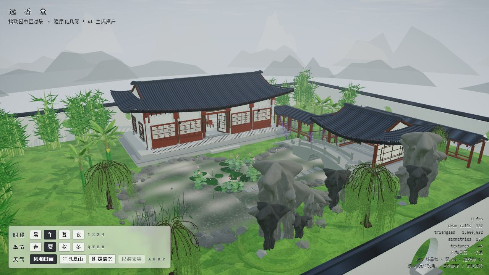
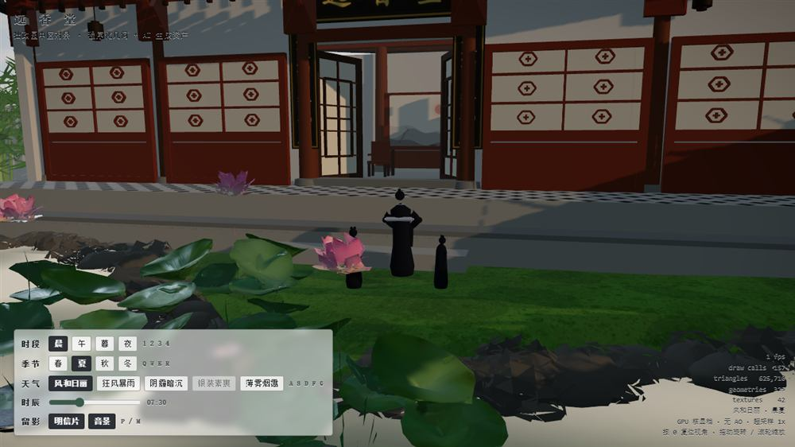
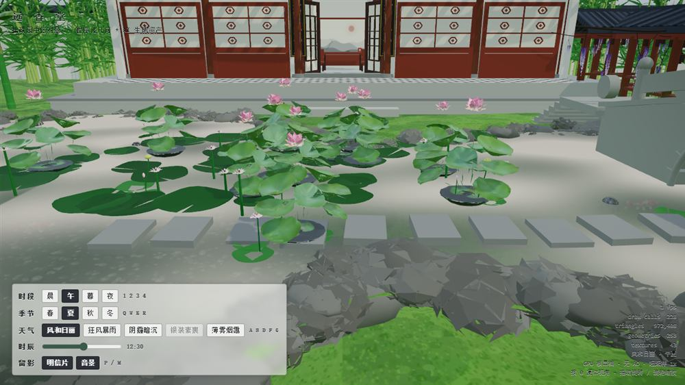
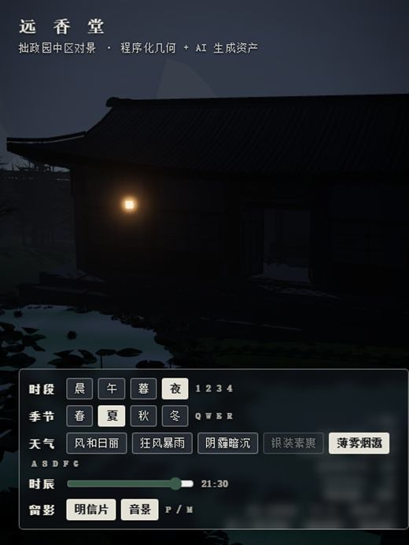

# 苏州园林 · 拙政园远香堂对景

> 用 Three.js 在浏览器里重建一座江南园林：**程序化建模 + 三轴可交互环境系统 + 零 CDN 离线交付**。
> 打开 `index.html` 即是完整的园林 —— 远香堂、水榭、游廊、石桥、太湖石假山、荷池竹柳，以及晨昏四季阴晴雨雪。

```
时段 晨 午 暮 夜  ×  季节 春 夏 秋 冬  ×  天气 风和日丽 / 狂风暴雨 / 阴霾暗沉 / 银装素裹 / 薄雾烟霭
外加一根 0~24h 连续时辰滑杆 —— 任意组合都是 2.8 秒平滑过渡，不是硬切贴图。
```

---



*正午 · 夏 · 风和日丽。截图取自无头软渲染回归（SwiftShader），实机画面更亮更锐。*

### 效果图

| 私塾晨课（点景人物） | 荷池生态（莲蓬 · 浮叶 · 汀步） | 夜 · 薄雾（灯笼与星空） |
|---|---|---|
|  |  |  |

---

## 目录

- [快速开始](#快速开始)
- [操作方式](#操作方式)
- [实现了什么](#实现了什么)
- [三轴环境系统](#三轴环境系统)
- [渲染管线与性能取舍](#渲染管线与性能取舍)
- [项目结构](#项目结构)
- [代码地图](#代码地图)
- [验证体系](#验证体系)
- [关键工程决策与踩坑记录](#关键工程决策与踩坑记录)
- [开发计划：继续优化与完善](#开发计划继续优化与完善)
- [文档索引](#文档索引)

---

## 快速开始

```bash
npm install          # 只为本地开发（three + esbuild）；页面本身不依赖 node_modules

npm run serve        # 静态服务器 → http://127.0.0.1:8935
npm run check        # 语法门禁（src/*.js 逐个 node --check，1 秒）
npm run audit        # 拆分守卫：漏 import / 给 import 绑定赋值 / 引用内联专有名（3 秒）
npm test             # 无头回归 55 项（Playwright 加载真实页面做断言）
npm run verify       # **一条命令串行跑全部 58 道门**（≈15m，交付前必跑）

npm run build:vendor # 重新打包 vendor.js（three + addons → 本地 ESM）
```

> ⚠️ **不要用 `file://` 直接打开** `index.html` —— ES module 与 `.glb` 会被 CORS 拦下。
> 必须经由 http 服务（`npm run serve`、`python -m http.server` 或任意静态托管）。
> 若启动失败，页面会给出可读的失败态与「重试」按钮，而不是永远停在「营造中…」。

**部署**：整个站点 = `index.html` + `src/*.js` + `vendor.js` + `assets/*.glb`（外加 PWA 三件套
`manifest.webmanifest` / `sw.js` / `icons/`），纯静态，丢进任意静态托管即可。
**离线/内网可用**：three.js 与全部 addons 已由 esbuild 打进本地 `vendor.js`，页面**不请求任何外部 CDN**
（大陆网络下 unpkg / jsDelivr 常不稳定，这是硬约束）。资产分发另有**可选** CDN 轨道（默认关闭，见下节）。

### 可选 CDN 基址（双轨 · 默认关闭）

`assets/*.glb` 与 `assets/thunder.mp3` 默认全部走本地相对路径。需要把资产分流到 CDN 时**不用改代码**，两个开关任选其一：

- **URL 参数**（只影响本次加载，优先级更高）：`index.html?cdn=<encodeURIComponent(基址)>`，
  例 `?cdn=https%3A%2F%2Fcdn.example.com%2Fsg%2F`；
- **localStorage**（该浏览器持续生效）：`localStorage.setItem('suzhou-cdn-base', 'https://cdn.example.com/sg/')` 后刷新。

行为要点：

- 基址会归一尾斜杠后拼在相对路径前（`assets/koi.glb` → `https://cdn.example.com/sg/assets/koi.glb`），
  预载清单键与 SW 缓存键都不变；
- **失败自动回退本地**：某资产从 CDN 报错、或超过预载预算 60%（180s 中的 108s）仍未到手，
  会自动用本地路径重试一次；**本地也失败才算真失败**，照旧走 `settleAsset(false)` + 程序化替身的降级链；
- 诊断状态在 `src/13-preload.js` 的 `CDN_STATE`（`on` / `hit` / `fallback` / `fail`）；
- Service Worker 只缓存同源请求：CDN 请求不进 SW 缓存，本地回退照常享受离线缓存；
- **默认（不带开关）`base` 为空串**：`assetUrl()` 原样返回相对路径，请求与纯本地部署逐字节等价。

---

## 操作方式

| 输入 | 作用 |
|---|---|
| 鼠标拖动 / 滚轮 | 旋转视角 / 缩放（OrbitControls，触屏双指同样可用） |
| `1` `2` `3` `4` | 时段：晨 / 午 / 暮 / 夜（把连续时辰对齐到 7:30 / 12:30 / 17:30 / 21:30） |
| `Q` `W` `E` `R` | 季节：春 / 夏 / 秋 / 冬 |
| `A` `S` `D` `F` `G` | 天气：风和日丽 / 狂风暴雨 / 阴霾暗沉 / 银装素裹 / 薄雾烟霭 |
| 时辰滑杆 | 0~24h 连续时间，拖动 0.45s 跟手；日落、月夜、黎明渐亮都是连续量 |
| `P` 或「明信片」 | 现场渲一帧 + 合成题跋（「远香堂 / 拙政园·时辰季节天气 / 日期」）→ 下载 PNG |
| `M` 或「音景」 | 开关程序化音景（风 / 雨 / 虫鸣 / 鸟鸣，零音频资产） |
| `Z` 或「导览」四个按钮 | 机位巡览：立峰·云根 / 远香堂 / 荷风四面 / 全园（1.4s 平滑飞行，从当前画面出发） |
| `T` 或「巡游」 | 带字幕自动巡游：立峰 → 题名石 → 远香堂 → 荷风四面 → 全园，每站停留 6s、**边飞边出字幕**；任意交互即接管 |
| `X` 或「偶得」 | 随机一幅景色：时段按出片率加权、季节均匀、天气先按季节过滤合法集再按时段调权；三连全同则重抽 |
| 点击水面 | 投石问路：在点处起一圈涟漪（按下→松开位移 >6px 视为转视角，不起圈） |
| 「长曝」 | 长曝光明信片：28 帧加性堆积 —— 星点走成圆弧、萤火拖出断点虚线、雨丝拉成银线 → 下载 PNG |
| `0` 或 `Home` | 视角复位 |

快捷键在输入框内、输入法组合中、长按重复、以及 `Ctrl/Cmd/Alt` 组合下自动让行（不抢浏览器快捷键）。

---

## 实现了什么

**建筑与园林要素**（全部程序化几何 + Canvas 生成贴图）
歇山屋顶（起翘翼角、正脊/垂脊/筒瓦、斗拱、山花）· 格扇门窗（步步锦 / 冰裂纹 / 直棂 / 清式四种窗格）·
挂落 · 美人靠 · 匾额对联（Canvas 书法字）· 台基 · 粉墙与墙帽 · 青砖斜铺地面 ·
临水**水榭** · 折线**游廊** · 石拱桥 · 汀步 · 太湖石假山（三变体峰型 + 山脊连绵带）· 四层远山景深。

**水**
实时平面反射（Reflector）+ 自定义水面着色器 · 水波法线双轴漂移 · 涟漪池（InstancedMesh 20 环）·
雨点涟漪 · 锦鲤沿椭圆轨道游动并**按「鱼背穿越水面」的符号变化**在出水/入水各触发一圈涟漪 ·
乌龟壳贴水面缓游并留尾迹。

**植被与季节物候**
竹（叶片绝对量随季节：春 0.28 / 夏 1.0 / 秋 0.43 / 冬 0.33）· 垂柳（alpha 叶帘飘带 + 七件套叶幕 + 扇区均密）·
紫藤（总状花序，逐朵渐变、梢端收尖）· 芭蕉（果轴 + 5 圈把 + 新月蕉指 + 熟度 instanceColor 渐变）·
荷花/睡莲/莲蓬（三层明暗籽孔 + 生态伴生）· 水草芦苇 · 草地。
所有植被走**保留明度的换色**做季节色调，走共享 uniform 的顶点风场做摆动（每片叶独立 hash 相位）。

**人物与动物**
**点景人物**文人 / 书童 —— lathe 直裰 + 无脸圆头 + 发髻玉簪（刻意不做五官以规避恐怖谷），
**四分区分色**：袍身主色 / 腰带 / 米白衣缘（**交领 V**·立领·袖口·后中缝）/ 近黑发髻。
躯干是**两层结构**：外层 `root`（位置/朝向/整体缩放）+ 内层 `body`（**椭圆截面** ×1.15 / ×0.82，
把回转体的肩宽从 2.15 个头宽拉到 3.3 —— 头挂外层、不跟着压扁）。
色值与明度定标由 `probe/figure-palette.mjs` 量参考图得到、再由 `probe/figure-audit.mjs` 把守
（见「关键工程决策与踩坑记录 · 11 / 14 / 15」）。带**日程**：晨 7:30~12 私塾晨课（先生执卷居中 + 两书童前侧**半围**朝先生）、
午间转水榭、夜间游廊缓行（**步态**：按位移推进步相，躯干前倾 + 迈步起伏）；
有效天气为暴雨 / 雪 / 冬季雨时全体隐藏。另有锦鲤、乌龟、蜻蜓（振翅 + 游弋航迹）。

**环境与后期**
三轴环境系统见下节 · GPU 粒子雨雪（着色器内画精灵，CPU 推进位置以支持风偏）·
积雪注入（按法线朝上程度，竹叶/芭蕉叶有专门加成）· 地面湿润 · 昼夜灯笼自发光 + Bloom ·
星空 · 云层漂移 · 水墨屏风背景。

**入场 · 留影 · 氛围**（2026-09-20 晚 ~ 09-21）
**开场运镜** —— 加载页 0.7s 淡出正好遮住起幅跳切：K0 云外俯瞰（池南上空，先看清全园布局）
→ K1 贴水南推（y=4.6 越过南岸石脊，立峰从画面左侧退过）→ K2 交付机位（与按 `0` 复位同落点），
两段共 5.4s（2.6 + 2.8s，先从容后带加速）。飞行期 `controls.enabled=false`，否则 OrbitControls 的
拖拽/阻尼会和关键帧插值抢相机；`minDistance` 临时放开到 0.2、落位后还原。任意 `pointerdown` /
`wheel` / 键击立即让位 —— 「带看」不是「锁死」。探针（`navigator.webdriver`）与 `prefers-reduced-motion`
默认不播（回归会拿到「正在飞」的相机，几十条机位/像素断言全漂），`?intro=1` 强制、`?intro=0` 强制关。
**加载页** —— 水墨封面 Ken Burns + 流光进度条，两条动画都走 CSS 合成层：**主线程被着色器编译冻住时它们照常在动**。
进度不是假动画，由暖编译按桶真实回填，文案 `营 造 中 · 立屋架 20%` → `即 将 开 园`。
**偶得**（`X`）· **点击涟漪**（射线打水面 + 6px 手势过滤 + `insidePond` 池域复核）·
**长曝光明信片**（28 帧加性堆积 + 暗部胶片颗粒）· **丁达尔体积光**（灯体锥形散射，`uLamp` 随时段、`uRain` 随雨改 alpha）·
**夏夜萤火虫**（只在夏 · 夜 · 晴/薄雾亮，明灭与漂移全在顶点着色器按独立相位算，不用 CPU 逐帧改属性）·
**桃花四季**（叶冠 / 花 / 果 / 落花四条显隐通道，**先花后叶**；花瓣与花共用裸色底 + `instanceColor` 上色，以区别于红梅的大红）·
**带字幕巡游**（`T`，五站 + 每站 6s 停留 + 任意交互接管）。

**工程侧**
启动失败兜底 UI · 几何合并前机器校验（属性计数 / 索引越界 / 非有限坐标）·
WebGL 上下文恢复 · 移动端 320px 布局与 `aria-pressed` · `window.__garden` 调试口（供采集脚本与测试驱动）·
无头回归门禁 **58 道**（`npm run verify` 串行跑通，≈15m；其中 `npm test` = smoke 单门 **55 项断言全绿**）。
（口径基准：**2026-10-04**。门数以 `verify-all.mjs` 的 `SUITES` 表为唯一真值 —— 想拿准数就数它，
别信本文里的数字：这段话自己就漂过五次，30 → 52 → 56 → 57 → 58。）

---

## 三轴环境系统

这是整个项目的架构核心（`src/12-env.js`，对应原第 12 节）。

```
ENV_TIME (4 档)   ─┐
ENV_SEASON (4 档) ─┼─→ resolveEnv() ─→ 参数集 ─→ mixInto() 缓动 ─→ applyEnv()
ENV_WEATHER (5 档)─┘        │                                        │
                     ENV.hour (0~24 连续)                 灯光/雾/天空/后处理/材质注入/存在性
```

**关键设计：每根轴只写「自己那部分」，最终由组合规则合成。**
时段预设写光色/光强/天空/雾/曝光/Bloom/调色；季节预设只写植被色调与物候（与时段无关）；
天气预设只写乘性或加性修正与天气专属通道（`rainAmount` / `snowCover` / `wetness` / `windMul` …）。
**结果：不需要为每种组合各写一套预设** —— 这正是这套系统在 6600 行里没有失控的原因。

**组合合法性**：4 时段 × 4 季节 × 5 天气 = 80 种组合，其中「银装素裹」仅冬季合法，
非法 12 组（3 个非冬季 × 4 时段）由 `enforceWeather()` 强制降级，**合法组合 68 种**。
UI 置灰只是提示，真正的收口在 `setEnv()`：键盘、控制台、外部脚本都绕不过去。
「冬季 + 狂风暴雨」是合法组合，但渲染为风雪（雨置换为雪 + 积雪），标签改写为「狂风细雨」。

**连续时辰**：`ENV.hour` 是唯一时间源，四个锚点（7.5 / 12.5 / 17.5 / 21.5）之间分段插值，
夜段 21:30→4:30 维持深夜、4:30~7:30 黎明渐亮。点时段按钮 = 把 hour 拉回锚点；拖滑杆 = 直接操纵时间轴。
切季节不会丢失自定义时刻。

**过渡**：一律 2.8s 缓动（滑杆 0.45s），且**从当前实际画面出发**（`ENV.from = cloneParams(ENV.cur)`），
连点按钮也不会跳变。天气被强制降级时同样走平滑过渡，而不是瞬切。

**状态机防护**：`setEnv()` 用 `Object.hasOwn` 做白名单校验 —— 否则 `setEnv('time', 'constructor')`
这类继承键会污染状态并让 `resolveEnv` 崩溃。

---

## 渲染管线与性能取舍

```
RenderPass → GTAO(仅独显档) → UnrealBloom → GradeShader(对比/分离调色/饱和/暗角) → OutputPass
                │
                └─ AO 阶段隐藏 foliage、并按下去平面反射与阴影重渲（try/finally 还原）
```

| 决策 | 原因与代价 |
|---|---|
| **阴影按需更新** `autoUpdate=false` | 6144² 深度图原本每帧全量重渲（约 3770 万纹素）且被 Reflector 再渲一遍。改为三处显式失效：环境过渡帧 / 资产迟到 / WebGL 上下文恢复 |
| **竹·柳叶减面** 52 tri → 8 tri | 全场最大杠杆：叶量约 4 万片，省下约 180 万三角形 |
| **超采样 1.5 → 1.15 + 像素预算封顶** | 1.5× 是 2.25 倍像素面积，用户实测掉到十几帧；加 `PIXEL_BUDGET` 后 DPR=3 的手机不再爆 9 倍像素 |
| **几何合并** `mergeStatics()` | 按「同材质 + 同阴影标记」合并静态网格，draw call 从数百降到几十；镜像（负行列式）物体合并时翻绕序，否则背面剔除下直接消失 |
| **GTAO 只给独显档** | AO 需要额外一遍法线渲染（几何再画一次），核显代价不可接受；同时按材质排除 foliage |
| **阴影视体随太阳仰角自适应** | 暮时太阳仰角仅约 13°、堂高 7m 影长 30m，固定 ±28/±24 会硬切长影；按仰角放大到最多 2.2×，代价是黄昏 texel 密度 110/m → 约 73/m（宁可略糊，不可硬切） |
| **烟雾/雨雪/反射分档** | 雨 14000 点（核显 5000）、雪 2400（1200）、水面反射 RT 640、核显档直接不走真实平面反射 |
| **核显/独显两档** `GPU_TIER` | 由 `WEBGL_debug_renderer_info` 判定，联动阴影贴图（6144² / 2048²）、超采样、GTAO、粒子量 |
| **启动分帧暖编译** `warmBoot()` | 首帧段原本 8.2s 全花在**同步**编译着色器上，加载页只能干等。改为按材质重量（Physical/Standard=3、Shader=2、其他=1）贪心分 **10 桶**、逐帧揭示，天空球独占第 1 桶（它和 20+ 材质挤一桶会让首帧卡 2s）；每桶走**真实 `composer.render()`** 而非裸 `renderer.compile()` —— program key 含灯组/阴影/输出色彩空间等渲染期状态，裸 compile 编出来的与 `RenderPass` 宏组合对不上，彩排帧会整批重编（实测 37→87 个，比不暖机更慢）。分桶期关掉阴影更新 / 水面钩子 / Bloom / GTAO（阴影图与水面反射都是"全场景再渲一遍"的重 pass，12 桶各跑一次要多烧约 1.4s），压到最后一次**彩排帧**一次编齐。桶数选 10：再多每桶的 rAF + 后处理固定开销会把总耗时拉长（12 桶实测多约 0.3s） |

**实测（1280×720 同条件，性能优化前后）**

| 指标 | 优化前 | 优化后 | 变化 |
|---|---:|---:|---:|
| 场景三角形总量 | 3,533,681 | 1,713,137 | −51.5% |
| 每帧提交三角形 | 3,677,006 | 1,666,032 | −54.7% |
| draw calls（稳态） | 479 | 377~389 | −90（阴影 pass 移出每帧路径） |
| 渲染耗时均值 | 5.3 ms | 3.4 ms | −36% |
| 渲染耗时 p95 | 12.3 ms | 6.4 ms | −48% |

**最近一次启动分段实测**（`probe/_p01-bootmarks.mjs`，1280×720，ANGLE/D3D11 真 GPU，
`Intel Iris Xe Graphics` → `GPU_TIER = 'low'`，冷着色器缓存）：

```
贴图·太湖石canvas 82.7 → 渲染器 235.3 → 天空·PMREM 650.9 → 几何合并 1019.2
  → 暖机 10292.1 → 首帧 10366.9ms ｜ 合计 10367ms
```

除暖机外，18 个 JS 段**全部 ≤130ms**（几何合并 111 / 场景几何 98 / 主建 97 / 天空·PMREM 411）。
`暖机` 是唯一的长段 —— 而它正是"把 8 秒编译摊成 10 帧"的地方。所以真正要问的是：
**这笔摊开值不值？** 于是做了一次同机 A/B（`outputs/_diag/_ab-warm.mjs`，一次性诊断、不入库）：
同一台机、同一块 GPU、同一份代码，只在传输层把 `warmBoot()` 换成 `Promise.resolve()`（其余逐字不动），
每轮**开全新浏览器**取冷着色器缓存 —— 否则编译缓存会在浏览器内跨页面复用，谁排在后面谁快，A/B 直接失效
（第一版就栽在这上面：warm-ON 两轮差 5.6 倍）。

| （三轮独立复跑的中位） | 暖编译开 | 暖编译关（老路径） | 差 |
|---|---:|---:|---|
| 启动合计 | 10,485 ~ 11,211 ms | 9,136 ~ 9,978 ms | **+1.1 ~ 1.4 s（+12 ~ 15%）** |
| 暖机段 | 9,140 ~ 9,927 ms | — | 新增 |
| **首帧段** | **77 ~ 85 ms** | **7,871 ~ 8,179 ms** | **−8.0 s（−99%）** |

**结论：这不是"变快了"，是"把 8 秒的硬冻拆成 10 次可播报的等待"**，代价约 1.2s 额外总时长。
值不值取决于一件事：**加载页那两条 CSS 动画在冻住期间会不会继续动** —— 会，所以用户看到的是
"进度条在爬"而不是"白屏死等"。（暖机前 1.0s + 暖机 9.1s 里，画面更新只能以帧为粒度。）

**残留观察（未定论、未修）**：暖编译开时 `renderer.info.programs` 停在 **63~64**，老路径是 **60**，
多出 3~4 个（约 6%）。`calls 412~421`、`tris 1.90M` 两边已对齐，所以**不是"多挂了物件"**；
怀疑是分桶帧在"关 Bloom/GTAO · 阴影不更新 · 水面钩子置空"的非生产状态下，把少数材质编成了另一份宏。
量级约 0.4s，优先级低于其余事项。

---

## 项目结构

```
suzhou-garden/
├─ index.html            559 行壳：CSS + DOM + `import` 装配 + 启动兜底（场景代码全在 src/，见「单文件拆模块」）
├─ src/                  场景代码 16 个模块 / 约 11700 行，按原节号命名（00-config … 13-preload + 2b-wind + app）
│                        ⚠️ 模块**顶层**代码在 import 时就会跑 —— 加东西前先读 README 里那两条破环通则
├─ vendor.js             esbuild 打包的 three r184 + addons 本地 ESM（零 CDN，含 Draco/KTX2/Meshopt 解码器）
├─ sw.js                 Service Worker：壳 stale-while-revalidate + GLB cache-first（PWA 离线）
├─ manifest.webmanifest  PWA 清单（独立窗口 / 主题色 / SVG 图标）
├─ build-entry.js        vendor 打包入口（新增 addon 时在这里补一行）
├─ assets/               约 2.7 MB · 5 个 GLB（贴图已重编码压缩）：锦鲤 / 龟 / 荷 / 芭蕉 / 金刚鹦鹉
│                        ＋ thunder.mp3（懒加载的点缀音效）。其余全部程序化生成
├─ probe/                探针 85 个 .mjs：门禁 / 审计 / 样张 / 诊断（串行跑，并行会争渲染资源）
│                        ⚙️ 一次性诊断脚本归档在 `probe/_attic/<日期>/`（不入库，搬回原路径即复原）
│  ├─ verify-all.mjs     **一条命令串行跑全部 58 道门**（`npm run verify`，≈15m；门数以它的 SUITES 表为准）
│  ├─ check.mjs          语法门禁：src/*.js 逐个 node --check
│  ├─ codeonly-unit.mjs  语法判定单元门禁：`_codeonly.mjs` 的"什么算引用"契约（判宽=假红、判窄=假绿，两个方向都静默）
│  ├─ import-audit.mjs   拆分守卫（4 条判据，见「单文件拆模块」）：漏 import / 给 import 绑定赋值 /
│  │                     引用内联模块专有名字 —— 后两类都是**运行期才炸或完全静默**的
│  ├─ _codeonly.mjs      ⚙️ 工具：check / import-audit / _extract-section 共用的"语法判定"单点（改它必跑 codeonly-unit）
│  ├─ _extract-section.mjs ⚙️ 工具：按原节号把内联模块的一段抽成 src/NN-*.js（含依赖检测 / --auto 补 import / --trim）
│  ├─ preload-manifest-sync.mjs **预载清单一致性（7 项判据 + 4 条负例自检）**：sw.js 的 GLBS
│  │                     与 13-preload 的 PRELOAD_MANIFEST 必须**同一批**（双向差集 + bytes
│  │                     对磁盘 + SHELL 完整性）。纯 node、<1s。守的是一条写在两个文件注释里、
│  │                     此前**无人把守**的红线：2026-10-02 加金刚鹦鹉时只改了 13 漏了 sw.js，
│  │                     而当时全套门禁全绿（check 遍历的就是清单本身 ⇒ 看不见"少了一件"），
│  │                     危害是**装成 PWA 后断网首开少一只鹦鹉**（required:false ⇒ 更静默）
│  ├─ pwa-cache.mjs      PWA 离线（缓存隔离 + **在线预热** + 9 项离线资源 + 断网重载 + 五类 GLB）
│  ├─ smoke.mjs          55 项无头回归（自带 http 服务 + Playwright）
│  ├─ wind-trajectory.mjs 风场轨迹门禁（6 项，纯数学）：轨迹是"细长条"还是"椭圆"（2026-09-18 的"植物打转"）
│  ├─ shadow-cover.mjs   阴影视体覆盖门禁（16 项，纯几何）：园子地面网格点有多少落在 ortho 盒外
│  │                     ⚠️ 判据**不能**用像素 —— 暴雨雨丝逐帧随机，任何像素差分都退化成噪点图
│  ├─ pageerror-guard.mjs 运行时异常守卫（17 项）：**每次交互之后**都查 pageerror +
│  │                     "同状态连续两帧字节全同 = render 没在跑"判活性 + 像素差判「状态变了画面跟着变没」
│  ├─ reel-guard.mjs     时光流转门禁（16 项）　├─ lamp-guard.mjs 灯笼照明门禁（11 项）
│  ├─ mist-guard.mjs     夜雾远山门禁（25 项）：雾里远山不许比天空亮（MeshBasicMaterial 不吃光）
│  ├─ postcard-guard.mjs 明信片款式门禁（7 项）：钤印/题款；⚠️ 朱砂红必须在**夏季正午**测（秋枫色域重叠）
│  ├─ sound-guard.mjs    音景分层门禁（22 项）：`Snd.plan(p)` 是纯函数 → 无音频设备也能断言"夏午有蝉、冬没虫"
│  ├─ guide-guard.mjs    首次引导门禁（18 项）：一半判据在验**它有没有挡别人的路**（全屏 z-index:8 覆盖物）
│  ├─ wind-audit.mjs     风场审计（16 项）：谁进了风场 / 什么模式 / 多大振幅 / 位移上限 + 灯笼单摆支点实测
│  ├─ wisteria-color.mjs 紫藤配色门禁（5 项）：花穗渐变**方向**（上浅下深）—— 渐变写反不会有任何报错
│  ├─ koi-orbit.mjs      锦鲤/泳龟轨道越界门禁（9 项）：按池多边形**逐点**判内外 + 量离岸余量（含凹岸与全抖动区间）
│  ├─ perch-dragonfly.mjs 停栖蜻蜓门禁（14 项）：锚点是否乘过 instanceMatrix / 定时换点 / 不逐帧漂移 / 冬季隐藏
│  ├─ stone-audit.mjs    立峰·题名石审计（16 项）：欧拉示性数数**透孔数**、连通分量、瘦/收分/悬挑、卧石长高比与朝向
│  ├─ stele-legibility.mjs 题名石可读性门禁（8 项）：从 `stele` 近观机位**硬判**首个命中与正面度 +
│  │                     `gotoViewpoint` 是否把机位自带的 minDist 传下去（否则近观被弹回 9m）
│  ├─ figure-audit.mjs   人物门禁（服色 + 步态 + 取景）：袍身不许退回近黑剪影、腰带要有明度对比、
│  │                     同框角色服色要拉开、近景机位不许被 minDistance 弹回 9m、**相机到取景目标不许被遮挡**
│  │                     （机位靠候选环射线**求解**，不是硬编码偏移）、散步不许退回"站桩滑行"
│  │                     （均速/前倾/步相/起伏四项）。顺带出 3 张人物样张
│  ├─ figure-foot-guard.mjs **人物落脚门禁（4 项，纯射线 ~17s，入 quick）**：每个人物脚底必须
│  │                     贴着他**脚下那个面**（向下打射线取第一个 y<3.0 的命中，跳过屋顶/檐口），
│  │                     且那个面**不能是水面**；散步的人**沿整条散步区间扫描**（起点对不代表全程对）。
│  │                     守的是此前**零覆盖**的一类：figure-audit 查服色/道具/取景但不查脚底，
│  │                     layout-fingerprint 不哈希人物（noMerge）⇒ 2026-10-04 实测抓到两例 ——
│  │                     品茗的人 y 写死 0、陷进水榭台基 0.62m（1.61m 的人只剩 1.0m 露在外面），
│  │                     夜步的人散步区间越过游廊端点、有 2.5m 走在池面上。自带负例自检
│  ├─ refract-guard.mjs  水面真折射门禁（11 项）：把折射贴图读出来，验「鱼真的被渲进了池底贴图」
│  │                     且「世界 XZ → 纹素的映射方向没反」。两件事都**只能靠读像素**——
│  │                     状态/几何/贴图尺寸全对，鱼也可能全数"落在"池底上（正交相机的
│  │                     left/right/top/bottom 是相机空间量，而相机架在池心正上方 → 相机空间
│  │                     y = 世界z − 3，把世界包围盒直接塞进去会让视锥只盖池南一半）
│  ├─ refract-coverage.mjs 折射层**覆盖度**门禁（5 项）：正向清单（点名对象必须在层里，删一行标记就红）
│  │                     + 反向扫描（凡"下探水面 >15cm 且压到池体"却不在层的逐个报出，只放行
│  │                     **写了理由**的白名单）+ 计数下限。refract-guard 验的是"我想到要看的东西"，
│  │                     本门验的是"还有谁该在里面"——P2-5 首版就漏了池中立峰水下 1.24m、石矶、
│  │                     两伴石、三张驳岸石实例网格、石根草叶，状态全对、只有遍历场景才发现
│  ├─ weather-coverage.mjs 天气名单**覆盖度**门禁（14 项）：谁该积雪 / 该打湿却没被登记。
│  │                     判据四层 —— G0 自检（把竹竿移出雪表，G1 必须报红：探针自己证明"我能红"）、
│  │                     G1~G4 名单与标记的**对象身份**比对（零启发式）、G5 阳性对照、
│  │                     G6 像素行为（同一天气下**只切** uSnowCover：整幅 Δ 证明手段有效 +
│  │                     石刻 ROI 内有像素被盖白 + 无差异时占比必须为 0 的自证）。
│  │                     抓到的两处：竹竿 `bambooA/B` 配了 0.85（全表最高）积雪加成却不在雪表里
│  │                     （那加成从来是死代码）、题名石刻只登记 `wet` 漏了 `snow`
│  │                     ⚠️ 判据**不能**要求"石头明显变白"：太湖石朝上的面只占 31.6%，雪按
│  │                     "朝上程度"混白，竖面本来就上不去雪 —— 那是物理事实，不是缺陷
│  ├─ intro-guard.mjs   开场运镜门禁（22 项）：探针下不自动播、`?intro=1` 从 K0 起飞、
│  │                     **飞行期间焦点被冻结**（controls.enabled=false + minDistance 放开到 0.2）、
│  │                     走完 seg 0→2 后落点与 overview 机位吻合（实测 0.00m）、
│  │                     让位后原地冻结（键盘 K 位移 0.0000m）＋滚轮只让位不位移。
│  │                     ⚠️ 判"冻结"别用滚轮：滚轮本身就会触发 OrbitControls 变焦
│  ├─ loading-guard.mjs 加载页门禁（18 项）：结构 7 件齐全、封面图 200、Ken Burns 是慢推（≥5s）、
│  │                     流光条无限循环、首帧后 `.done` + `pointer-events:none` + 已淡出，
│  │                     以及**进度必须真的在动**（≥3 个中间宽度、单调不减、终值 100%、≤14 次更新＝
│  │                     10 个暖编译桶）与阶段名只取自 `WARM_STAGES`、收尾换成「即 将 开 园」。
│  │                     ⚠️ 主线程在编译期是冻的，`page.evaluate` 轮询抓不到中间态 ——
│  │                     必须 `addInitScript` 预挂 `MutationObserver`；
│  │                     ⚠️ `animationDuration` 返回逗号列（"1.1s, 10s"），`parseFloat` 只读第一个
│  ├─ warmboot-guard.mjs 分帧暖编译门禁（9 项，**自带负例**）：出现「暖机」刻度且在几何合并之后、
│  │                     本身在真干活（≥3s）、首帧段 ≤800ms（暖 46ms / 老路径 4780ms）；
│  │                     负例＝传输层把 `warmBoot()` 换成 `Promise.resolve()` 再跑一遍，
│  │                     要求它**首帧段 >3000ms** 且「暖机」刻度消失 —— 探针自己证明判据能红；
│  │                     另钉总时长代价（≤+35%，实测 +261ms）与 program 数膨胀（≤+6，实测 +3）。
│  │                     ⚠️ 两个配置**各开一个全新 browser**：着色器缓存跨页面复用，
│  │                     同一 browser 里跑两遍会变成"谁排后面谁快"（首版实测差 5.6 倍）
│  ├─ random-guard.mjs  偶得随机场景门禁（14 项，600 抽）：三轴组合全合法（`weatherMutexReason` 为空，
│  │                     **核心**）、非冬不出雪、时辰落在锚点 ±0.6h、相邻不重复、标签三段式且与三轴
│  │                     一致（防"抽 A 报 B"）、四季四时段都抽得到、时段加权方向对（暮/夜 > 正午）、
│  │                     夜里晴+雾占比高于白天。⚠️ 代码里 `nightish` **只认 `time==='night'`**，
│  │                     把 dusk 并进"夜"会假红（首版 68% vs 69% 就是这么来的）；
│  │                     ⚠️ 比例类判据 120 抽只有 ~2σ、600 抽才 ~6σ
│  ├─ lampvol-guard.mjs 丁达尔体积光门禁（28 项，需 `?tier=high`）：5 盏各 1 光团 + 1 光斑、
│  │                     几何必须是 **SphereGeometry**（退回 ConeGeometry 即红）且基半径 1
│  │                     （否则 volR 不再等于世界半径）、光团与灯内点光源**同父级且同高**
│  │                     （防改挂到挂点 pivot）、光斑平躺圆形、uLamp 随时段 / uRain 随天气 /
│  │                     色温暖橙、**地面光斑那份材质也同步**；再加阳性对照（冻风 + 冻光团自身
│  │                     湍流时钟后，只把 uLamp 归零 → 灯周变暗 6.2σ、热点落在光团格、
│  │                     局部信号 15× 全幅＝不是全屏洗白）。⚠️ 三条踩过的坑：窗口要对准**光团球心**
│  │                     （`lanternGroups` 存的是挂点、比灯体高 45px）；必须冻风（不冻时局部噪声
│  │                     5.1 luma > 信号 1.45）；噪声估计要用稳健 σ 而非**极差**（极差随样本数
│  │                     单调增长＝自己加码，4 样本 ×3 等于要求 10σ）
│  ├─ willow-audit.mjs   柳冠俯视闭合度审计（8 扇区 × 3 环带射线覆盖率）
│  ├─ pwa-cache.mjs      PWA 专项：缓存隔离 + 断网启动 + 四模型挂载验证
│  ├─ pwa-cold-restart.mjs PWA 冷启动：持久化 profile 在线预热 → 关浏览器 → 断网重载
│  ├─ _coverage-audit.mjs / _snow-diag.mjs    **只读诊断**（不入链）：名单覆盖度的人肉清单 + 雪注入取证
│  ├─ _program-audit.mjs / _program-count.mjs **只读诊断**（不入链）：首帧 63 个 shader program 的
│  │                     归因（cacheKey 逐 token 拆分 / usedTimes 分活孤儿 / 折射开关对照）。
│  │                     结论见 PITFALLS §30；`compileAsync` 已实测为负优化，别再试
│  ├─ hero-shot.mjs      特置立峰样稿：晨/午/暮 + 近景 + 隔离样张，并量测"漏透率"
│  ├─ visual-check.mjs   视觉验收样稿：紫藤 / 荷花低视角 / 竹林 / 灯笼 / 柳树 / 芭蕉 · 静风 vs 狂风同机位
│  ├─ shots-round8.mjs   第八轮样张：锦鲤俯视 / 收腰特写 / 立峰·题名石 / 两只停栖蜻蜓近景
│  ├─ asset-shots.mjs    资产样张批次（`[outDir]` 可指定输出目录）
│  ├─ boot-diag.mjs      启动延迟链**到达时刻**诊断（`deferBoot` 大件没插队时会 165s 才到位）
│  ├─ _p02-tdz.mjs       ⚙️ 工具：把启动期 pageerror 的**完整栈**打出来（smoke 只打 message，
│  │                     而 "Cannot access 'X' before initialization" 这类消息**不带行号**，
│  │                     十几个模块里谁在顶层读了谁，靠猜必错 —— 拆模块时靠它定位了 5 处环）
│  ├─ stele-block.mjs    遮挡物 + 地表剖面诊断（竖扫报首个命中体/法线/命中点，沿法线竖直下探得地表高度）
│  ├─ stele-viewpoint.mjs 近观机位求解：300 候选 × 逐高度射线打分，选正面度最优
│  ├─ stele-station.mjs  机位**端到端**落位验证：真调 `gotoViewpoint` 后量实际相机距离（慢 ~3min，不入链）
│  ├─ stele-clean.mjs    净室可读性验证（关掉草地/棱面干扰，单独量刻字对比度）
│  ├─ scene-survey.mjs   浮空/残留物普查：遍历可见网格筛"整块悬空且小"的候选（几何核对视觉模型误报用）
│  ├─ pixel-probe.mjs    渲染后**像素**取样（字色对比度的量化判据，眼睛给不出 RGB 差值）
│  ├─ crop-zoom.mjs      局部裁切放大：`<in.png> <out.png> [x0 y0 w h zoom]`（本机无 PIL，放大样张靠它）
│  ├─ glb-profile.mjs    GLB 顶点高度剖面（直接解 GLB 容器读 POSITION）：定位花瓣/叶盘所在高度
│  ├─ palette-ref.mjs    参考图调色板取样：headless canvas 解码照片，按色相分出花/叶并沿穗分带统计
│  ├─ figure-palette.mjs 画风参考图的**服色**取样：按 HSV 色相分桶统计高饱和像素（=衣着），
│  │                     报各桶均值/受光/背光 + 背景明度 + "衣色 vs 背景暗部"的对比预算（0~1 归一化裁剪）
│  ├─ repack-glb.mjs     GLB 贴图离线重编码（`--apply` 先备份再覆盖 `assets/`）
│  └─ serve.mjs          零依赖静态服务器（默认 8935）
├─ outputs/              开发证据（**未入库**，见 .gitignore）：审计 / 分析 / 交接文档 + 迭代截图
│  └─ _attic/2026-09-18/ 一次性诊断探针归档（**未物理删除**，搬回同名路径即复原；清单见该目录 MANIFEST.md）
│     └─ 2026-09-20/      同上（拆模块时的一次性诊断：绑定赋值扫描 / 四类 GLB 挂载计数）
└─ docs/                 README 配图（4 张压缩截图，约 320 KB）
```

## 代码地图

`src/` 按**原节号**命名的 16 个模块（每个文件顶部带导航注释；`index.html` 只剩 CSS + DOM + `import` 装配）。

⚠️ 模块**没有**作用域隔离：`src/*.js` 顶层代码在 `import` 时就会跑，且模块之间**不共享词法世界** ——
在 src 里引用内联脚本里定义的名字不会报错，只会静默 `undefined`（被 `.catch()` 吞掉就是"GLB 静默不加载"）。
加东西前先读「单文件拆模块」里那两条破环通则。

| 节 | 内容 |
|---|---|
| 0 · 配置与工具 | `CFG` 常量、可复现随机 `mulberry32`（固定种子，每次刷新形态一致）、启动失败兜底、`BOOT` / `bootMark` |
| 1 · 材质库 | Canvas 程序化贴图（筒瓦/青砖/草地/池底/匾额/水墨/太湖石/水波法线/**桃花瓣**）+ 天气角色注册 + 风场注入 |
| 2 · 渲染器 / 相机 / 控制器 | GPU 档位、像素预算、超采样、OrbitControls、天空球（含长曝光星轨相位 `uStarRot`） |
| 3 · 通用构件工厂 | 中式屋顶（起翘/脊/瓦）、斗拱、窗格四式、挂落、美人靠、墙段、匾额对联 |
| 4 · 建筑 | 远香堂 / 水榭 / 游廊 |
| 5 · 水体 · 桥 · 驳岸 | 池塘形状与池底、Reflector 水面、驳岸石、石拱桥、汀步 |
| 6 · 植被 | 竹 / 柳 / 紫藤 / 芭蕉 / 荷 / 睡莲 / 莲蓬 / 水草 / 芦苇 / **桃（叶·花·果·落花）** / 涟漪池 / 锦鲤 / 太湖石峰 / **夏夜萤火虫** |
| 7 · 地面 · 围墙 · 远山 | 草地、青砖铺地、粉墙、四层远山 |
| 8 · 组装场景 | 全园摆放 + 人物（四分区分色 + 日程 + 步态）+ **开场运镜**（3 关键帧状态机）+ **带字幕巡游** |
| 9 · 灯光 | 平行光 + 阴影按需更新 + 环境补光 + 半球光 + 几何校验 + 静态合并 |
| 10 · 后处理 | MSAA 渲染目标 + GTAO + Bloom + 自研调色 + Output |
| 12 · 环境时序系统 | 三轴预设表、组合规则、过渡、天气表现、积雪/湿润注入、雨雪粒子、UI 同步、**偶得·随机景色**、**丁达尔体积光** |
| 11 · 循环与自适应 | 主循环、**分帧暖编译 `warmBoot`**、程序化音景、明信片 + **长曝光合成**、stats 面板（**注意：第 11 节排在文件末尾**） |

---

## 验证体系

| 门禁 | 命令 | 说明 |
|---|---|---|
| 语法 | `npm run check` | `src/*.js`（16 个模块）+ `build-entry.js` + `sw.js` 逐个 `node --check`，1 秒出结果 |
| 拆分 | `npm run audit` | `import-audit.mjs` 四条判据（漏 import / 给 import 绑定赋值 / 引用内联专有名），3 秒 |
| 拆分 | `node probe/codeonly-unit.mjs` | `_codeonly.mjs` 的"什么算引用"契约单元测试，0.2 秒 |
| 回归 | `npm test` | Playwright 无头加载真实页面，**55 项断言**，退出码即结论 |
| 全量 | `npm run verify` | **一条命令串行跑全部 58 道门**（check → codeonly-unit → **preload-manifest-sync** → import-audit → wind-trajectory → shadow-cover → smoke → pageerror-guard → reel-guard → lamp-guard → mist-guard → … → **pwa-cache** → … → legibility-guard），任何一个红整体非零退出。⚠️ 完整清单以 `verify-all.mjs` 的 `SUITES` 表为准（下面这张表也已不是全量） |
| 分层 | `npm run verify:quick` | 9 道快门（≈2 分钟）：check / codeonly-unit / preload-manifest-sync / import-audit / smoke / pageerror / **figure-foot-guard** / layout-fingerprint / random —— 日常改动后的兜底 |
| 分层 | `node probe/verify-all.mjs --gates=mist-guard,hill-guard` | 只跑指定门（对 path 与 label 做子串匹配；**匹配不到就响亮报错**，不许"0 道门全绿"） |
| 视觉 | 截图比对 | 新截图命名带版本号（`-v2`），与 `outputs/shots-*` 基线对比 |
| 专项 | `node probe/willow-audit.mjs` | 柳冠俯视覆盖率（扇区 × 环带射线求交，不依赖软渲染像素） |
| 专项 | `node probe/hero-shot.mjs [--isolate]` | 立峰样稿（隔离 / 近景 / 三态），并输出**漏透率**：材质临时改 DoubleSide，撒 90×90 平行射线，统计"穿过轮廓且穿墙"的格数占比 |
| 专项 | `node probe/pwa-cache.mjs` | PWA：外域缓存隔离（保留）+ 8 项资源断网 200 + 断网启动 + 四类 GLB 挂载 + 零 pageerror |
| 专项 | `node probe/pwa-cold-restart.mjs` | PWA 冷启动：持久化 profile 在线预热 → 关闭浏览器 → 断网重载，验证"关掉再开"仍可用 |
| 专项 | `node probe/wind-audit.mjs` | **风场审计（25 项）**：材质清单（进没进风场 / base·crown·tip 模式 / 振幅 / 位移上限）+ **L1/L2 调度器**（先在暴雨下回读 `windMul` 确认前提，再手动步进 900 秒仿真：风向 16 档栅格误差 <1e-6、档位号→`uWindVec` 映射、换向跨整数档且保持 ≥12s；风力只在天气区间内换档、保持 ≥5s、晴/暴雨区间分级、晴天增益 ≪ 暴雨增益）+ 灯笼单摆支点实测（绳上端位移恒为 0、位移随离支点距离递增）+ 荷花杆高与 GLB 花位下限对齐（丛顶取**最高株**，异步挂载下抓"第一株"会随机换株） |
| 专项 | `node probe/wind-trajectory.mjs` | **风场轨迹门禁（6 项，纯数学、<1s）**：把位移合成公式镜像到 JS，在**风向坐标系**里量"走向比（横/沿）、净转圈/s、方向一致率"。守"轨迹是细长条还是椭圆" —— 椭圆就是用户看到的"规律性旋转"（实测旧公式 0.52／抖振通道 0.75 → 改造后 0.22／0.26）。这类错误不报错、不崩、不影响任何别的断言，只有形状指标能抓 |
| 专项 | `node probe/wisteria-color.mjs` | **紫藤配色门禁（5 项）**：读花穗实例的 `instanceColor`，验"上浅下深"—— y–明度相关系数 + 同穗连续段前 1/4 比后 1/4 亮（结构判据）+ 两端色值落在参考图量级。渐变写反不报错、不崩，只能靠这条拦 |
| 专项 | `node probe/palette-ref.mjs <image>` | 参考图调色板：headless canvas 解码，按 HSV 色相分出"花（紫）/叶（绿）"，沿花穗竖直三等分报均值/受光 25%/背光 25% —— 配色校准拿数，不靠肉眼 |
| 专项 | `node probe/glb-profile.mjs [file]` | GLB 顶点高度剖面：分桶统计顶点数与水平半径，辨别"花瓣簇（半径小、密集）"与"叶盘（半径大）" —— 定位花位靠它，不靠猜 |
| 专项 | `node probe/koi-orbit.mjs` | **锦鲤轨道越界门禁（9 项）**：按池多边形逐点判内外 + 量点到岸线的最短距离，扫全周期 × 全抖动区间（含凹岸）；并自检"旧写法必须被判出池"，保证判据有牙 |
| 专项 | `node probe/perch-dragonfly.mjs` | **停栖蜻蜓门禁（14 项）**：锚点世界坐标是否乘过 instanceMatrix（不塌成一点）、贴锚点精度、手动步进 10 秒不漂走、连做 3 次转场且换了停点、冬季同口径隐藏 |
| 专项 | `node probe/stone-audit.mjs` | **立峰·题名石审计（16 项）**：欧拉示性数数真透孔（χ=2C−2g−b，要数**边界环**不是边界边，否则 g 为负）、连通分量、瘦/收分/悬挑、题名石长高比与朝向与墨迹 |
| 专项 | `node probe/stele-legibility.mjs` | **题名石可读性门禁（8 项）**：从 `stele`（云根近观）机位打射线**硬判**"首个命中=题名石且正面度 < −0.2"；另断言 `gotoViewpoint` 确实把机位自带的 `minDist` 交给 `flyTo`（OrbitControls 每帧夹半径，漏传就被静默弹回 9m —— 方位对、行程走完、不报错） |
| 专项 | `node probe/longexposure-guard.mjs` | **长曝光明信片门禁（6 项）**：合成本身不炸 + 零 pageerror；合成期间临时抬起的 `uStarRot` 必须**归零**（忘复位＝日常星星天天转，不报错、不崩）；长曝 ≠ 单帧（星移 / 萤火拖尾 / 水面拉丝会让像素分布明显变化）。样张 `outputs/visual/lxp-*.png` |
| 专项 | `node probe/peach-guard.mjs` | **桃花四季与晴午波光门禁（12 项）**：桃是落叶观花乔木 → 生命周期必须由**季节显隐通道**驱动：春（叶/花/落花在、果隐）、夏（果现、花隐）、秋（叶在、花/落花隐）、冬（叶/花/果/落花**全隐**，裸枝过冬）；另验"晴午水面太阳波光"只在**接近正午 × 晴天**亮（夜 / 暴雨 = 0）。样张 `outputs/visual/peach-*.png` |

| 专项 | `node probe/intro-guard.mjs` | **开场运镜门禁（22 项）**：探针 / 减弱动效下不自动播、`?intro=1` 从 K0（云外俯瞰）起飞、飞行期间 `controls.enabled=false` 且 `minDistance` 放开到 0.2（否则焦点会被每帧夹回）、走完 K0→K2 后落点与 `overview` 机位吻合（实测 0.00m）、让位后**原地冻结**（键盘 `K` 位移 0.0000m）＋滚轮只让位不位移。⚠️ 判"冻结"别用滚轮：滚轮本身会触发 OrbitControls 变焦，相机合法移动 → 假红 |
| 专项 | `node probe/loading-guard.mjs` | **加载页门禁（18 项）**：结构 7 件齐全 / 封面图 200 / Ken Burns 是慢推（≥5s）/ 流光条 infinite / 首帧后 `.done` + `pointer-events:none` + 已淡出，以及**进度必须真的在动**（≥3 个中间宽度、单调不减、终值 100%、更新次数 ≤14 与 10 个暖编译桶吻合）与阶段名只取自 `WARM_STAGES`、收尾文案换成「即 将 开 园」。⚠️ 编译期主线程是冻的，`page.evaluate` 轮询抓不到中间态 —— 必须 `addInitScript` 预挂 `MutationObserver` |
| 专项 | `node probe/warmboot-guard.mjs` | **分帧暖编译门禁（9 项，自带负例）**：出现「暖机」刻度且在几何合并之后、本身真在干活（≥3s）、**首帧段 ≤800ms**（暖 46ms / 老路径 4780ms）；负例＝传输层把 `warmBoot()` 换成 `Promise.resolve()` 再跑一遍，要求首帧段 **>3000ms** 且「暖机」刻度消失 —— 探针自己证明判据能红；另钉总时长代价（≤+35%，实测 +261ms）与 program 膨胀（≤+6，实测 +3）。⚠️ 两个配置**各开一个全新 browser**：着色器缓存跨页面复用，同一 browser 里跑两遍会变成"谁排后面谁快"（首版实测差 5.6 倍） |
| 专项 | `node probe/random-guard.mjs` | **偶得随机场景门禁（14 项，600 抽）**：三轴组合全合法（`weatherMutexReason` 为空，**核心**）、非冬不出雪、时辰落在锚点 ±0.6h、相邻不重复、标签三段式且与三轴一致（防"抽 A 报 B"）、四季四时段都抽得到、时段加权方向对（暮/夜 > 正午）、夜里晴+雾占比高于白天。⚠️ 代码里 `nightish` **只认 `time==='night'`**，把 dusk 并进"夜"会假红（首版 68% vs 69%）；⚠️ 比例类判据 120 抽只有 ~2σ，600 抽才 ~6σ |
| 专项 | `node probe/lampvol-guard.mjs` | **丁达尔体积光门禁（28 项，需 `?tier=high`）**：5 盏各 1 光团 + 1 光斑、几何必须是 **SphereGeometry**（退回 ConeGeometry 即红）且基半径 1（否则 `volR` 不再等于世界半径）、光团与灯内点光源**同父级且同高**（防改挂到挂点 pivot）、光斑平躺圆形、uLamp 随时段 / uRain 随天气 / 色温暖橙、**地面光斑那份材质也同步**；再加阳性对照（冻风 + 冻光团自身湍流时钟后只把 uLamp 归零 → 灯周变暗 **6.2σ**、差分热点落在光团格、局部信号 15× 全幅＝不是全屏洗白）。⚠️ 三条踩过的坑：窗口要对准**光团球心**（`lanternGroups` 存的是挂点、比灯体高 45px）；必须冻风（不冻时局部噪声 5.1 luma > 信号 1.45，方向判据一次对一次错）；噪声估计要用**稳健 σ** 而非极差（极差随样本数单调增长＝自己加码，4 样本 ×3 等于要求 10σ） |

| 专项 | `node probe/figure-audit.mjs` | **人物服色 / 衣构件 / 步态 / 朝向 / 取景门禁（45 项）**：读**实际材质**验袍身没退回近黑剪影、与 `FIG_PALETTE` 接线一致、腰带与袍身有明度对比；**交领必须 2 条**（1 条＝少半边，读不出"交"）+ 下摆衣缘存在 + 与袍身明度对比；**手持道具不许被袍身吞掉**（射线只打人物自身子树）；同框角色（slot 重叠）服色必须拉开；机位落位距离不许被 `minDistance` 夹回 9m、**身上 9 点（3×3）采样被挡 ≤2 处**（候选环射线求解，环按人物朝向旋转以默认拍正脸）、**机位自身周围必须有净空**（10 向短射线，防"相机扎进草丛"，见决策 17）、**拍前重测目标仍在画面内**（NDC）；散步不许退回"站桩滑行"（均速 / 前倾 / 步相按位移推进 / 身体起伏 / **朝向跟行进方向**）。顺带出 3 张人物样张 |

**当前状态（2026-10-03 局部复验）**：本轮改了 `sw.js`（GLBS 补 `Macaw.glb` + CACHE v15）、
`src/08-assemble.js`（鹦鹉 holder 命名）与四支探针（新增 `preload-manifest-sync`、
`pwa-cache` 补在线预热并入链、`smoke` GLB 名单补第五类）。
已复验 **`check` PASS（`src` 16 模块）｜`preload-manifest-sync` 7/7 + 自检 4 变异全红｜
`smoke` 55/55（draw calls 299 / 三角形 1,641,932）｜`hill-guard` 10/10｜`season-demo-guard` 18/18｜
`pwa-cache` PASS（9 项离线资源 + 五类 GLB）｜`afterrain` 24/24｜`postrain` 14/14｜
`legibility` 8/8｜`stele-legibility` 8/8｜`layout-fingerprint` PASS｜`mist-guard` 25/25**。
⚠️ `12-env.js` 本轮**最终无净改动**（试改雾色钳制后按"收益 1 luma vs 打破白天观感保证"回退，
见 P1-0）。剩余门待一次安静机器上的全量 `npm run verify` 收口。

**历史基线：`npm run verify` 三十道门全绿（2026-09-22 复验，12m14s；mist-guard 单门 185~390s 波动）—— `check` PASS（`index.html` 559 行壳 + `src` 15 模块 / 11639 行）｜`codeonly-unit` PASS｜`import-audit` PASS｜`wind-trajectory` 6/6｜`shadow-cover` 16/16｜`smoke` 52/52（draw calls 296 / 三角形 1.51M）｜`pageerror-guard` 17/17｜`reel-guard` 16/16｜`lamp-guard` 11/11｜`mist-guard` 25/25｜`postcard-guard` 7/7｜`longexposure-guard` 6/6｜`peach-guard` 12/12｜`sound-guard` 22/22｜`guide-guard` 18/18｜`wind-audit` 25/25｜`wisteria-color` 5/5｜`koi-orbit` 9/9｜`perch-dragonfly` 14/14｜`stone-audit` 16/16｜`stele-legibility` 8/8｜`figure-audit` 45/45｜`refract-guard` 11/11｜`refract-coverage` 5/5｜`weather-coverage` 14/14｜`intro-guard` 22/22｜`loading-guard` 18/18｜`warmboot-guard` 9/9（首帧 46ms vs 老路径 4780ms）｜`random-guard` 14/14（600 抽）｜`lampvol-guard` 28/28（阳性对照 6.2σ）。**

> 回到这一轮的五道新门：单门耗时 21.7s / 10.1s / 25.6s / 9.5s / 44.1s，合计 **+1m51s**。
> ⚠️ 跑链期间**别做观感/帧率测试**：30 门各起一个真实 GPU 的 Chromium，会抢显存与 CPU。

`npm test` 覆盖：启动零 console error · 几何合并零校验告警 · 四类 GLB 到齐 · draw calls <800 ·
三角形 <420 万 · 锦鲤在游动 · 切夜过渡收敛与光强下调 · 暴雨雨量/底值风（审计 B03 回归）·
夏季雪被拒且按钮置灰 · 冬季雪合法生效 · 晨雾密度区间 · 时辰滑杆拖动与 `HH:MM` 读数 ·
时段按钮回锚点 · 明信片生成含题跋 PNG · 音景开关往返 · `0` 键复位 · stats 刷新 ·
视口缩放自适应 · 移动端 320px 无横向溢出 / `aria-pressed` 齐全 / 命中区 ≥38px ·
PWA 三件套可取且注册不报错 · 导览巡游启停与字幕联动 · QOS 三档像素比往返 · 后台暂停接线。

> 无头软渲染（SwiftShader）下截图偏暗、fps 显示极低，**只用于结构与像素级回归，不代表实机帧率**。
> 天气/时段切换需等 `ENV.t >= 1` 再截图，否则会截到过渡中间态。

---

## 关键工程决策与踩坑记录

代码注释按「现象 → 根因 → 修法 → 实测数据」记录，这里摘录对外最有参考价值的若干条：

1. **零 CDN 是硬约束**。three + addons 一律 esbuild 打进 `vendor.js`；新增 addon 必须同时改 `build-entry.js` 与 `package.json` 的 `build:vendor`，否则页面报模块缺失。
2. **组合规则胜过预设穷举**。三轴各写自己那一半，`resolveEnv()` 合成 —— 加一档天气只需一张预设表（实测：把「薄雾烟霭」加到全季节可用，只动了 `ENV_WEATHER` 与规则表）。
3. **阴影不要每帧渲**。`shadowMap.autoUpdate = false` + 三处显式失效，是单次改动里最大的 GPU 节省；但**辅助 pass（GTAO / Reflector）会把场景再渲一遍**，必须在辅助 pass 期间把反射与阴影一起按下去（`try/finally` 还原）。
4. **GTAO 里改 `visible` 必须存原值还原**。曾经一律置 `true`，导致帧末对象可见性与 `applyPresence()` 的意图不一致：运行时侥幸正确，但任何直接调用 `composer.render()` 的旁路（采集脚本/控制台）会照 `true` 画 —— 实测冬季采集图里睡莲叶铺满水面。
5. **合并几何要处理镜像**。把 `matrixWorld` 烘进几何后，负行列式物体的绕序会反转：背面剔除下直接看不见；DoubleSide 材质虽然还能画，但 AO 法线 pass 与积雪判据读到的是反法线。翻一次绕序即可。
6. **合并前必须机器校验几何**。太湖石顶心曾只 push position 不 push uv，11 座峰合并后少 11/4 条 uv —— 不报错、不 NaN，只是那几个三角形采到越界 uv。
7. **`ShaderPass` 会克隆 uniforms**。写模板里的 `uniforms` 等于写给一份没人用的副本：实测「夜 + 阴霾」下模板 saturation 已变成 0.662，而真正生效的 pass 还停在 1.06 —— 也就是说对比/饱和/分离调色/暗角**从来没随时段变过**。
8. **风场不能用共享相位**。`sin/cos` 共用一个相位会让整棵树绕椭圆轨道同步转（用户判：「轮胎打转」）。改为每片叶独立 hash 相位 + X/Z 不同频 + 慢变风向角。
9. **明信片必须先现渲一帧**。画布没有 `preserveDrawingBuffer`，缓冲区合成后随时可能失底；`postcardData()` 先亲自 `composer.render()` 再取像素，任何时刻调用都新鲜。
10. **音景全部程序化合成**：风=低通白噪跟风场、雨=带通白噪跟雨量、虫鸣=4.3kHz 三角波 × 11Hz 调幅（仅夜间且安静）、鸟鸣=晨间随机上挑滑音。零音频资产，各层音量压低 —— 「听得见才对」，不是「听得清」。
11. **人物走剪影路线**。前史是「AI 把人物做得跟鬼一样」，病根是低模硬追写实五官/人体结构，正好落进恐怖谷；改为「以形写神」：无脸、宽袍大袖 lathe 剪影，信息量交给簪/领边/后中缝/袖口环几笔「留白」。
    **2026-09-18 上色**：剪影路线不动（仍然无脸），把单色墨蓝改成**四分区分色** —— 袍身主色 / 腰带 / 米白衣缘 / 近黑发髻。色值不是调出来的：先用 `probe/figure-palette.mjs` 量老黄给的风俗画参考图（宝蓝 `#57667B`、天青 `#73918D`、松绿 `#60786E`；**衣色与背景暗部的明度差只有 24** —— 它靠**色相**跳出来，不靠亮暗），再按本场景重新定标：本场景背景低饱和区 L≈178、冷色只占 1.5%、植被绿占 39% → 冷色相是空位，穿冷色＝独占色相。两条踩过的坑：①**不能照抄参考图的明度**（它是"褪色绢本"的暗调，我们的场景是正常曝光）；②**草坪是绿底**，绿袍上草坪就隐身 —— 首版把松绿给了童袍，与草坪只有 ΔRGB 49，样张里那孩子几乎看不见，现改为"站草坪的角色一律用非绿色相"。
12. **散步≠站着平移**。原实现只有 `position` 平移、姿态仍是负手站桩，而 `sp=0.11` 反算出 **2.24 m/s**（慢走的两倍半）——姿态再站桩，读作"滑行"是必然。改法：步相按**走过的距离**推进（不是按时间，掉头时才不会乱步）、`sp` 降到 0.027（0.55 m/s）、躯干前倾 + 迈步起伏 + 左右轻摆。人是裙摆没有腿，走路感只能靠这三件套。
13. **不要用 `Clock` + 钳制兜底**。改用 `THREE.Timer` 并 `connect(document)`：切后台自动挂起计时，回前台不会出现「一帧跳 40 秒」。fps 统计必须用真实帧间隔 —— 用被钳到 50ms 的 `dt` 记账，真实 10fps 会被显示成 20fps，右下角那个数字就成了安慰剂。
14. **"不像人"的主因是体块，不是颜色**。上色之后样张里人物仍读作保龄球瓶 —— 病根是袍身走 `LatheGeometry`（**回转体**），肩宽 = 2×0.186 = 0.37 m，而头宽 0.172 m，**肩只有 2.15 个头宽**（真人 ≈3）。修法：把人物拆成两层 —— 外层 `root`（位置/朝向/整体缩放）+ 内层 `body`（**椭圆截面** ×1.15 / ×0.82），肩宽拉到 3.3 个头宽，而**头挂外层**不被压扁。
    ⚠️ 拆两层会连带三个静默断点（都不报错）：`userData.robe` / `userData.breathPhase` 还挂在 `body` 上 → 渲染循环读 `f.userData.robe.scale` 直接 undefined 崩；`traverse` 还扫 `body` → 挂在 `root` 上的**头发/发髻/玉簪不是 `noMerge`，会被 `mergeStatics` 并进静态大网，人一走头留在原地**；茶姿那句 `g.rotation.z` 写在躯干层 → 变成"两层各歪一点"。三条都是"看图才发现"的类型。
15. **机位"距离对" ≠ "看得到"**（第九门自己漏判过）。门禁只断言机位落位距离在区间内，结果相机落到游廊栏杆后面、**画面前景全是横梁，照样 PASS** —— 2.29 m 正好落在 2.2~4.2 m 里。修法：机位改**候选环射线求解**（8 方位 × 2 半径，逐个打射线取第一个无遮挡的），门禁加**视线断言**（相机→取景目标，首个**非人物**命中在 `dAim − 0.35` 以内即判遮挡）；取景目标取"附近 4 m 内在场角色的重心"，且**在场判定必须用时段纯数据**，不能用 `o.visible`（它由渲染循环按小时更新，刚改完 `ENV.hour` 就读取到的是上一档 → 空集 → 重心除零 → **相机 NaN，而 NaN 的比较全是假绿**）。

16. **运动相位必须吃「累加仿真时间」，不能吃墙钟**。夜步者的 z 曾被写成 `timer.getElapsed()` 的实时函数，而循环里其余仿真一律用 `dt = min(rawDt, 0.05)` —— 软渲染一帧 8.4 s，于是 `t` 每帧跳 8.4、**人一帧瞬移 3.8 m**：门禁解算机位时人还在 `z=-3.48`（报"距离 2.47 m、视线通"），按快门时已漂出画面（NDC y=0.93）且被前景挡住。真机 60 fps 下两者等价，所以**这个缺陷只在低帧率/软渲染下现形，实机看不见**。正解：相位改吃累加量 `f.userData.strollT += dt` —— 代码库里锦鲤本来就是 `d.t += dt * speed` 累加、只有抖动项才吃原始 `t`，夜步者那段是漏网的。实测漂移 3.83 m → **0.14 m**、胸口 NDC 0.93 → **0.03**、首个遮挡 0.60 m（栏杆）→ **14.67 m**（地面）。
17. **单条射线 ≠ 看得见**（第九门连栽两次）。补上视线断言后，"相机→取景目标无遮挡"仍然只验了**一条线**；而草是稀疏的细长叶片，射线**从两片叶子之间穿了过去** → 报"首个遮挡 12.47 m"、门禁全绿，画面却被 8 条草叶横穿。改成"加净空断言 + 抬高机位"之后，**同一条判据又漏了一次**：垂下的**紫藤花穗正好罩住人物头部**，射线还是从花穗间隙穿过去 —— 人的头在画面里没了，门禁照旧全绿。所以最终把判据本身换掉：**身上 9 点（3×3）采样，被挡 ≤2 处**（花园里垂枝竹叶本就与人同框，苛求 0 会让所有机位都不合格；但 3 处以上意味着"人被盖住一块"，必须换机位），另加**机位近距净空**（相机周围 0.55 m 内向 10 个方向打短射线）并把近景机位抬到草层之上（`dy` 0.30 → 0.55，相机 y≈1.47 m）。**通用教训**：距离、朝向、视线各自都只是"看得见"的必要条件；判据要验到"画面里的实际观感"，而**薄片状遮挡是单射线判据的系统性盲区**。
18. **朝向要跟行进方向；日程里的 `yaw` 只是初值**。`D_SCHEDULES[2].yaw = π/2` 是"面朝 +x"，而人沿 z 轴来回走 —— 那是**侧着身子平移**（"滑行"的第二个来源，与相机漂移完全无关、也完全不受它影响）。修法：首帧 `f.rotation.y = atan2(dx, dz)` 定死，之后按 `dt` 平滑，角度先归一到 (−π, π] 否则掉头瞬间翻 180°。门禁判据做成**自检式**：`|cos(rotation.y)| ≥ 0.94` 且与 Δz 同号 —— 初始 yaw=π/2 时 cos≈0，步态没接管必然判红。
19. **候选环"看得见"≠"拍得对"**。只求无遮挡时 10c 拍到的是**背影**（人沿 z 走、环的默认起点恰好落在他身后），样张读不出交领/腰带/道具。修法：候选环**按人物朝向旋转**（方位角 α → α + `rotation.y`），首个候选即落在正前方；模型正面 = +z 时正面方位角恰好等于 `rotation.y`，一步到位。
20. **只给 `ENV.hour` 赋值，光照不会变**。光照/雾/天空/水色全由 `ENV.cur` 决定，而 `ENV.cur` **只在时辰滑杆的 input handler 里**由 `composeEnv(paramsAtHour(hour))` 重算。直接赋值只影响"人物时段门禁 + 时钟读数" —— 三张人物样张分别标着 7.5 / 9.0 / 21.5，画面却全是**正午硬光**（"晨课组"没有晨光、"夜步者"没有夜色），**标称与实物不符且不报错**。修法：探针走滑杆真实路径（`el.value = h; el.dispatchEvent(new Event('input'))`），再把 `ENV.t` 推到 0.994 —— 下一帧 `min(1, t + dt/dur)` 到 1、缓动 `e = 1`，环境一步到位（否则 0.45 s 的过渡在软渲染下要 9 帧 ≈ 75 s 才收敛，快门会按在过渡中间）。顺带也验了滑杆接线。样张③的时辰据此从 21.5 改为 **18.0（暮色起点）**：产品在深夜是**故意压暗**的，21.5 实测整幅近黑、服色读不出来，而样张的目的是展示服色而非演示夜景。

---

## 开发计划：继续优化与完善

> 图例：**P0** = 已列入待办、需拍板或影响观感；**P1** = 质量欠账 / 可验证的收敛项；**P2** = 体验增强。
> 每项给出「现状证据 → 落点 → 验收方式」，可直接当 issue 用。

### P0-1 人物资产路线拍板（剪影 vs 真实 3D 模型）—— ✅ 已拍板：走剪影路线（2026-09-18）

- **结论**：老黄 2026-09-18 给出画风参考图（工笔淡彩「点景人物」），要求「穿好看的衣服 + 协调动作」，
  即**接受剪影路线并按风俗画上色**，不再引入外部 3D 人物模型。落地：四分区分色 + 腰带 + 步态
  （见「关键工程决策与踩坑记录 · 14」），门禁 `probe/figure-audit.mjs`（45 项）。
- **原始记录（已过时，留档）**：人物为程序化水墨剪影（`makeScholar` / `makeChildScholar`，第 8 节），
  私塾晨课场景已过审（8.5/10），但「是否换成真实 3D 古代人物模型」始终未拍板 ——
  上次调研结论是网上找不到风格贴合、可直接下载的 CC0 成品（多为质量不稳的 AI 生成站）。
- **若日后仍要走 ②（外部模型）的落地路径**：新增 `assets/*.glb` 人物 → `loadAssetOnce()` 挂载 →
  复用现有日程系统（`figures` 数组 + 时段门禁 + 天气门禁）→ 需重做「水墨感」材质与夜景可见性
  （夜 + 阴霾 + 无配饰会变「影子人」）。
- **验收**：`npm test` 全绿 + 晨/午/夜 + 暴雨/雪 六态截图各一张。

### P0-2 夜间灯笼照亮环境 —— ✅ 已落地（2026-09-19）

- **原状**：灯笼是自发光小体 + Bloom 辉光 —— **只有灯自己亮，不照亮任何东西**。
  而且代码里埋了 2 盏 `PointLight` 却**从未接线**（`worldLights` 被填充却无人读取），
  于是它们白天也以固定强度亮着，还各自开着 `castShadow`（点光阴影是 6 面立方体贴图）。
- **已实现**：五盏全给（堂前 2 + 游廊 3），`applyEnv()` 的 `p.lamp` 通道接上第二个消费端
  （第一个是自发光强度）：晨/午 `lamp=0` 全灭、暮 `0.25` 半亮、夜 `1.0` 全亮。
- ⚠️ **强度必须按 1/d² 反算，不能拍脑袋**：r155+ 的点光是物理单位（坎德拉），
  辐照度 = `intensity / d²`。堂前灯挂在 4.85m 高，取 1.2 的话传到地面只剩
  `1.2 / 4.85² ≈ 0.05` —— 实测「开与关」整幅亮度只差 0.2，等于没照亮。
  按「地面留约 0.3 照度」反算 → 堂前 **6.5**、游廊 **2.8**（廊下更矮，光更聚拢）。
- ⚠️ **只调 `intensity`、绝不切 `visible`**：Three 的材质 program 缓存 key 含
  "参与渲染的灯数"，隐藏一盏 = 灯数变化 = 全场材质重新编译（几百毫秒卡顿）。
  强度归零仍占一点 ALU，换来的是切换环境时零重编译 —— 这笔交换是值的。
- ⚠️ `castShadow` 一律 false：一盏点光的阴影 = 6 面立方体贴图，顶六盏平行光。
- **验收**（`probe/lamp-guard.mjs`，11 项）：定点采样堂前灯笼正下方地面，
  亮度 **15.86 → 22.81（+43%）**；整幅像素差 0.85；五盏 `castShadow` 全 false；
  切换时段灯数恒为 5。

### P0-1 单文件拆模块 —— ✅ 已完成（2026-09-20）

- **已交付**：`index.html` 从 5000+ 行单文件拆成 **120 行壳**（只剩 `<style>`/DOM/import/启动兜底），
  ⚠️ 该「120 行」是 **2026-09-20 拆完当时**的数；其后 loading 页（水墨封面 + 流光进度条）与开场运镜的
  CSS/DOM 又加回壳里，**现为 559 行**（见「项目结构」）。两处口径别混：`npm run check` 报的
  「内联模块 **120 行**」指壳里那段 `<script>`（拆模块后没再长），**559** 才是文件总行数。
  其余全部落进 `src/*.js`，共 **15 个模块**（00-config / 01-materials / 02-scene / 03-factory /
  04-buildings / 05-water / 06-vegetation / 07-ground / 08-assemble / 09-lights / 10-post /
  11-loop / 12-env / 2b-wind / app）。`src/app.js` 仍为聚合占位（供后续 esbuild 打包）。
- **配套门禁**：新增 `probe/import-audit.mjs`（`npm run audit`）四条判据，并新增
  `probe/codeonly-unit.mjs`（`_codeonly.mjs` 的"什么算引用"契约单元测试）。**两条都已进 `npm run verify` 链**
  （纯 node，各 <3s，紧跟 check 之后 —— 拆模块的错误在浏览器里要么"加载即炸"、要么更坏的静默）。
- **验证**：`npm run verify` 二十一门全绿；smoke **50/50**；draw calls **693 < 800**（该项由性能优化 A 拿下，
  原 869 红已解除，见下）。
  ⚠️ 以上是**当日**基线；门禁链其后长到 **58 道**、smoke 到 **55 项**，draw calls 现读 **299**
  （693 → 299 的差额未完全归因：smoke 视口在 2026-09-20 15:55 改过，跨视口不可直接比）。

**拆模块暴露出的四类缺陷（都已修，且都已固化成门禁）** —— 这是本次最有价值的部分，
因为其中三类**不报错、不崩、只有专门的判据看得见**：

| 类型 | 症状 | 真身 | 现在由谁守 |
|---|---|---|---|
| ① ESM 环 + 顶层读取 | 启动期 `Cannot access 'X' before initialization`（X 依次是 `world`/`rr`/`windClock`/`gust`/`rippleInst`/`casterBoxDirty`） | 模块**顶层**代码在 import 时就会跑，而环让被读的那个模块还没求值完。原单体是线性执行，天然没有这个问题 | `npm test`（启动即炸） |
| ② 给 import 绑定赋值 | `TypeError: Assignment to constant variable`，**且不说名字** | 导入绑定只读。原单体里"§A 赋值 §B 的 `let`"天经地义，拆开后就是非法写 | `import-audit` 判据③ |
| ③ src 引用内联模块专有名字 | **完全静默**：三类 GLB 资产永远挂不上，零告警、零失败计数 | `06-vegetation` 读内联模块的 `$解码器`（src 与内联模块**不再共享词法世界**）→ ReferenceError；它在 `new Promise` 的 executor 里抛，被下游 `.catch(()=>{})` 吞掉 | `import-audit` 判据④ + smoke 的「四类 GLB 资产均已挂载」 |
| ④ 门禁自己的判宽/判窄 | 判宽→假红（让人去加一个**根本不该存在**的 import）；判窄→假绿 | `import-audit` 曾把"文件里出现过同名局部声明"当作豁免（一句 `const rr = r1 - r2` 给全模块几百处 `rr(a,b)` 背书）；`_codeonly` 用 `\b` 做标识符边界，而 `$` 不是词字符 → `$` 开头的名字永远匹配不到 | `codeonly-unit` + `shadowCoversAll`（只有局部声明**真罩住全部引用**才豁免） |

**两条可复用的通则**（已写进 `MEMORY.md`）：
- **破环只有两个正当手段**：`world` 这类**纯容器**下移到更上游的模块（02-scene）；
  只在**事件回调 / 延迟批**里用的引用走 `00-config` 的 `HOOKS` / `ENV_REF` 延迟绑定。
  ⚠️ 不要靠调 `index.html` 的 import 顺序来绕 —— 那是把正确性押在"当前这张依赖图恰好这样"上。
- **凡"跨模块的模块顶层副作用"都要显式问一句"它跑的时候对方就绪了吗"**：
  本轮把 `fitShadowCamera()` / `collectAOSkip()` / `initEnvScene()`（灯笼+季节缓存+applyEnv+installSnow）
  从各自模块顶层搬到 `08` 的 body 末尾 —— 那正是原 §8 跑完、`world` 填满的时点。

### P0-3 柳冠俯视闭合度打磨 — ✅ 已完成（2026-09-20 实测验收）

- **实测**：`node probe/willow-audit.mjs`（8 扇区 × 3 环带射线覆盖率）——
  **内环 100.0% / 中环 100.0% / 外环 93.7%**，扇区极差均值 内 0.0 / 中 0.0 / 外 5.5 pt；
  单树外环 100% / 94.6% / 100% / 80.1%，**最差单树 80.1% 亦 ≥ 75% 目标**。
  （旧基线中环 61% / 外环 51%，方向性破洞归零 —— 见 `outputs/suzhou-garden-analysis-2026-09-15.md`。）
- **性能红线同步复核**：draw calls **717**（<800）、三角形 **3,391,620**（<420 万），均有余量。
- **落点**：`makeWillow()`（第 6 节）叶幕七件套参数（顶幕横毯 + 碎叶云 + 外环确定性补种）。
- **残留薄区（不阻塞）**：外环 `[2.85-3.1]m` 带最薄，树3 该段仅 45.6%（其余单树 83.8~100%）。
  若要再收，先用 `willow-audit` + `npm test` 确认三角形余量，别凭肉眼加量。

### P0-4 特置立峰（太湖石）— 已落地：造型加强 + 石座 + 题名 + 专用机位

- **背景**：你提出把假山换成参考图那种「瘦、皱、漏、透」的太湖石。诊断结论：既有 `makeTaihuPeak` 是**星形径向曲面**（半径写成 r(θ,y) 的单值函数），拓扑上永远是亏格 0 的球面 —— **无论把"孔"挖多深都挖不出一个通洞**。所以这不是调参问题，是生成方式问题。
- **已实现**：新增 `makeTaihuHeroGeo()`（SDF 隐式场 + Surface Nets 等值面）：5~7 根指状石柱平滑熔接（smin）+ 中心石脊保证连通 + 管道挖洞 + 顶点 AO / 水线渍带 / 风化色斑一次烘进顶点色。摆位由池岸半径表反推、入土深度按 `makePondBed` 的碗形公式反算（否则石头会浮在水里）。
- **v2/v3 加强**（用户评审 v1：「平平无奇、食之无味」—— 根因是**统计上均匀**）：① 形体从"等权指柱"改为**一主二从三余**的层次（主柱带悬挑）② 圆柱改**圆台**（下粗上细的收分）③ 开一个能穿视的**大"眼"**（局部 +z 朝向池心，直径 0.4~0.5m）④ 加**侧向咬缺**（球缺啃出轮廓的进退）⑤ 表面从各向同性噪声改为**竖向流线皴纹**（相位随高度扭动）⑥ 挖洞改**圆角减法 smax**（消掉"纸片薄壁"）⑦ 生成器自带**碎片清理**：并查集求连通体，只保留最大块（比调参躲断裂稳）。
- **机器量测**（不靠肉眼）：漏透率 **17.2% / 21.1%**（±z / +x 射线穿墙占比）· 轮廓逐层半径变异系数 0.085（有收分/凹缺）· 连通分量 **1** · 面数 19,774 · 法线一致率 0.99 · 立峰几何 391ms · draw calls +4 · `npm test` 34/34 全绿。
- **石座 + 题名 + 机位（B）**：基座加**石矶**（低平岩台，高度按池底反算，埋进淤泥、露出水面）；岸上立**题名石刻「云根」**（Canvas 刻字贴图 + 碑框 + 朱文印，古谓石为云之根）；新增**导览机位**系统（`Z` 巡览 / 面板四个按钮，1.4s 平滑飞行）：立峰·云根 / 远香堂 / 荷风四面 / 全园。立峰机位的**距离按包围盒与 FOV 反算**，不写死（手写距离的教训见下）。
- **A（统一石头语言）的结论 —— 全量几何替换失败并回退**：曾用同源 SDF 生成器替换两座假山 + 连片的 15 块峰石，实测**更糟**：低网格 + 锥台并集渲染成一排片状"墓碑"，体量与峰势全丢，draw calls 195→580、三角形 +70 万。**回退**为：几何保留评审过 13 轮的径向峰，语言统一改走**材质 + 腔体 AO**（峰群换 `MAT.taihuLobe` 系并烘入"半径 vs 邻域"的腔体暗角）；同时把 `mergeStatics` 扩展为**可携带顶点色**（分桶键带"有无颜色"），否则带 AO 的石头只能单飞、draw calls 爆掉。
- **样张**：`outputs/hero/`（官方机位 / 隔离 / 近景 / 三态 / 假山）。探针支持 `--isolate`（隔离看石头）、`--rockery`（看南岸两座假山）、`--fast`（只出官方机位，调构图快 3 分钟）。
- **机器量测**：漏透率 **17.4% / 21.5%** · 连通分量 **1** · 法线一致率 0.989 · 面数 20,436 · 立峰几何 ~300ms · `npm test` 34/34 全绿。
- **仍可继续**：① 材质层（苔痕 / 水线分层 / 孔缘透光的假次表面散射）② 石矶与伴石的密度 ③ 导览补更多机位与字幕（P2-1）。

### P1-0 「上幅白带 / 远山溶进天空」✅ 已完成（2026-10-03，三层根因三个修法）

- **现象**：默认机位（正午·夏·晴）画面上幅有一条读数很白的横带，远山看不出四层叠剪影的层次。
- **量证**（`outputs/_diag/band-scan.mjs`，1400×800，逐行 + 按材质差分认身份）：
  - 高亮带 `y 48~101`（54 行）：山只占 **22.8%**、园景 0% ⇒ 那一行几乎全是天；
  - 整片上幅（y 0~330）天空 193~206，而 `distant` 层 190~207、`distantFar` 层 176~207
    ⇒ **后两层远山与天空同值**，剪影读不出来；
  - 默认机位俯角 19.3° + 半 FOV 22.5° ⇒ 可见天空只有地平线以上 **0~3°**
    ⇒ 整片可见天幕都落在天空 shader 的 `horizon` 色里，**本来就没有梯度**。
- **三个根因、三个修法（缺一不可）**：
  1. **环向覆盖不足**：四层卡数 14/12/10/8，覆盖 114% / 73% / 46% / **29%**
     （卡宽 26~54m × 张数 ÷ 2πr）——外两层缺口处直接露出天亮带。
     ⇒ 外三层加密到 16/18/24（97% / 83% / 87%）。
     ⚠️ `makeRidge` 每张卡消耗全局 `rr()`/`rnd()`（4 + 1 + nOld+1 次），改 `count`
     必须用 `burnRidge(原count)` 把旧序列**原位抽干**，三层的随机同时改走
     **本地种子流** ⇒ 全局流总抽数一位不差，`layout-fingerprint` 复跑逐位一致
     （远山卡片是普通 Mesh、本就不进指纹，故无需重出基线）。
  2. **雾色与天光同值**：正午 `fogColor`(0.884) 与 `skyHorizon`(0.898) 只差 **1.4%**，
     176m 处 Exp2 吃 57% ⇒ 最远层被混进"与天空同值"的颜色。
     ⇒ 正午 `fogColor` 0xDCE3E2 → **0xC6CCCB**。近园不受影响（20~40m 处雾贡献仅 1~3%，
     改的是 176m 外那圈）。
     ⚠️ 两条死路（都实测过，别重挖）：① `applyEnv` 里把「雾色≤天光」钳制扩到全天候
     —— 收益 1 lum、打破 `mist-guard` §1 的白天保证；② 压最远层**固有色** ——
     脊线九成是雾色，压 25% 只暗 1.9 lum，还把"层间色阶"余量从 5.86 吃到 2.88。
  3. **山脊不能咬掉月亮**：加密后远山铺满地平圈，夜里低仰角的月亮被咬
     （`night-sky-guard` 21:30 月轮覆盖 100%→55%、04:00 → 0%）。
     ⇒ 三层山高上限按月轮最低仰角 2.25° 反推：104m→**1.05**、138m→**0.78**、176m→**0.70**
     （轮廓函数里 `min(1.12, ridge)` 的峰顶系数已计入）。
- **实测**：亮带 54 行 → **31 行**、带内山覆盖 22.8% →（加密后）70%；
  `hill-guard` 脊线对比 −7.21 → **−6.65**（10/10）、层间色阶 29.6/12.9/5.9 → **31.6/15.3/8.1**；
  `night-sky-guard` 13/14 → **14/14**（顺手修好了 HEAD 上本就红的那条）；
  `mist-guard` 25/25；`verify:quick` 全绿；`layout-fingerprint` 与基线逐位一致。
- **诚实边界**：亮带没有清零（剩 31 行，y 45~75，跨地平线两侧）。那是"可见天带只有
  3° 高"与"山脊必须让月亮过（≤1.9°）"两个约束下的物理下限 —— 要清零就得把山脊
  抬过 3°，月亮就得让位。前后对照：`outputs/_diag/band-sbs.png`（A 改前 / B 只加密 / C 定稿）。

### P1-1 真机移动端验收（自动断言已覆盖，实机未验）

- **现状**：`npm test` 已断言 320px 视口下面板收进视口、无横向溢出、`aria-pressed` 齐全、命中区 ≥38px；但**真机触控、iOS Safari、横屏、低端安卓**未专项验收。
- **待做**：iOS Safari / Android 中低端各一台：单指旋转、双指缩放、面板换行、横屏布局、长时间运行的发热与降帧。
- **落点**：`@media (max-width:520px),(hover:none)` 段与 `GPU_TIER` 判定。
- **附带项**：`GPU_TIER` 目前是**一次性静态判定**（渲染器字符串正则），笔记本双显卡常跑在核显上（实测 Intel Iris Xe 仅 22.6fps）。建议补「帧率滞回自动升降档 + `visibilitychange` 暂停」，这是移动端体验的关键一环（审计 P01 / P07）。

### P1-2 夜 + 浓雾下远山比天空略亮 ✅ 已完成（2026-09-19）

- **真身不是雾色**：原判「夜段雾色明度高于夜空」是错的 —— 实测夜雾色 luma 仅 0.011，
  比夜空（0.030）**更暗**，雾色钳位一直是生效的。
  真正的病根是**远山材质**：四层远山是 `MeshBasicMaterial`（`MAT.distantNear/Deep/distant/distantFar`），
  **不吃任何光**，固有色写死白天的灰绿（0x76817F → 0xBCC3C2）。夜里灯光全暗下来，
  它却照旧按那个亮度渲染 → 实测**「山 35.36 vs 天 16.88」，剪影在夜空上反白发亮**。
- **修法**：远山 albedo 跟天光走 —— `hillAmb = clamp(curLum / ENV_BAKE_LUM, 0.06, 1.0)`，
  与 `scene.environmentIntensity` **同源同算**（山和它背后那片天同步变暗）。
  ⚠️ 必须从 `baseColor` 快照重算，就地乘会逐帧累积衰减成纯黑。floor 0.06 留一丝轮廓。
- **落点**：`DISTANT_MATS` 快照（第 1 节材质库）+ `applyEnv()` 环境贴图块之后。
- **验收**：`probe/mist-guard.mjs`（25 项）。判据用 Raycaster 按**材质身份**分出「山像素 / 天像素」，
  逐列配对比亮度（抵消天空垂直渐变）。修复后：夜晴 8.90 vs 16.41、夜雾 55.35 vs 56.40、
  夜阴 105.56 vs 124.20、夜暴雨 86.70 vs 104.07 —— 四种夜全部「山 ≤ 天」。
  ⚠️ 判据**验机制不验常数**：阴/暴雨夜天空本身被 `fogGray` 抬亮（hillDim 0.34/0.27）是**正确**的，
  第一版写死「夜里 albedo ≤ 0.20」把正确行为判成了红。
  `npm test` 晨雾密度断言仍落在 0.0068（0.0062~0.0085 内）。

### P1-3 GLB 资产压缩（3.95 MB → 目标约 1.2 MB）✅ 已完成

- **结果**：四个 GLB 共约 **1.04 MiB**（贴图离线 canvas 重编码为 JPEG，`probe/repack-glb.mjs`），远超 1.2 MB 目标。
- **配套**：`build-entry.js` 已增补 `DRACOLoader` / `KTX2Loader` / `MeshoptDecoder` 导出，`vendor.js` 重建，零 CDN 约束保持。
- **验收**：四类资产在 `npm test` / `pwa-cache.mjs` / `pwa-cold-restart.mjs` 中均断言挂载，纹理肉眼无差。

### P1-4 启动分片（消除同步长任务）— ✅ 已完成（2026-09-21）

两条路都落了地：

- **装配侧**：`deferBoot()` 把延迟装配切成"每帧一个 job"（`setTimeout(step, 0)`；软渲染下一帧可达 8.4s → **每多一个 job 就多等一帧**）。
  大件（立峰 / 柳 / 竹）必须 `deferBootFirst()` 插到队首 —— 排在 4 柳 + 18 竹之后，实测要 **165.2s** 才装配到位，
  而 job 自身只耗 811ms。当时探针窗口 240s 只是勉强够，那一轮的绿是运气不是能力。
- **着色器侧**：`warmBoot()` 分帧暖编译，见「渲染管线与性能取舍」。
- **实测**：除暖机外全部 JS 段 ≤130ms（几何合并 111 / 场景几何 98 / 主建 97）→ **单段 <250ms 达成**；
  **首帧段 8,179ms → 77ms**（同机 A/B）→ **首帧不劣化达成**。
- **残留**：暖编译在核显档上仍是每帧 0.85~1.0s（10 桶 + 彩排帧）。主线程冻的是这 11 次，
  加载页的 Ken Burns / 流光进度条走 CSS 合成层不受影响，但**画面更新**仍以帧为粒度 —— 是"有进度可看"，不是"真·无卡"。

### P2 体验增强（按价值/成本排序，均已在分析文档中立项）

| # | 项目 | 说明 | 成本 |
|---|---|---|---|
| P2-1 | **导览模式** | ✅ 已完成（2026-09-20）：预设机位 + 1.4s `flyTo` 巡览 + **带字幕自动巡游**（`T`）：五站 hero→stele→hall→pavilion→overview，每站停留 6s、**边飞边出字幕**，任意交互即停并收字幕（"带看"不是"锁死"）。⚠️ 近观机位离目标仅 2.86m，远小于 OrbitControls 默认下限 9m —— 必须把机位自带的 `minDist` 传进 `flyTo`，否则相机落位瞬间被 `controls.update()` 沿**视线方向**推回 9m：方位完全正确、行程也走完、还不报错，**只有量落位后的真实距离才看得出来**。门禁 `probe/smoke.mjs` §8.7（5 项：启停往返 / 字幕联动 / 飞行中不提前切站 / 画布接管即停 / 按钮文案往返） | 中 |
| P2-2 | **明信片排版** | ✅ 已完成（2026-09-19）：书画款式 —— 装裱细框 + 右侧竖排题款（地名 + 季节/时辰/天气小字）+ 朱文压角章（朱砂底阴刻「云根」+ 斑驳做旧）。门禁 `probe/postcard-guard.mjs`（7 项）；⚠️ 朱砂红像素统计**必须在夏季正午**测，秋天红枫色域与朱砂重叠会假红 | 低 |
| P2-3 | **音景细化** | ✅ 已完成（2026-09-19）：六层（风 / 雨 / 虫 / 蝉 / 蛙 / 鸟）+ 音量滑杆。新增夏季白天**蝉鸣**（带通白噪 ×55Hz 深 AM）、夏夜**蛙声**（230~320Hz 方波脉冲串，叫一阵停一阵）、**三种鸟**（山雀 / 画眉 / 白头鹎，按季节权重挑）。`Snd.plan(p)` 做成**纯函数**，门禁才能直接断言"夏午有蝉、夏夜有蛙、冬天没虫"。门禁 `probe/sound-guard.mjs`（22 项） | 低 |
| P2-4 | **PWA 离线** | ✅ 已完成：manifest + sw + icon（壳 stale-while-revalidate + GLB cache-first）。`sw.js` 清理只删 `suzhou-garden-v*` 前缀，不误伤同源其他应用。验收：`probe/pwa-cache.mjs`（隔离 + 断网启动）+ `probe/pwa-cold-restart.mjs`（关浏览器后断网重载） | 低 |
| P2-5 | **水面真折射** | ✅ 已完成（2026-09-20）：水面下另渲一张「俯视池底」贴图 —— 一架**只看水下层**的正交相机（layer 隔离：水面 / 天空 / 建筑 / 睡莲叶一律不进这张贴图，否则就是「水底里映着屋顶」），只渲池底 + 锦鲤 + 泳龟 + 水草几十个网格、半分辨率、不渲阴影，核显档也开得起（区别于平面反射把整场景再渲一遍，核显档是被关掉的）。水面 shader 再按波纹法线把采样 UV 掰弯后取它 —— 这才是「透过水面看到水底在晃」。⚠️ 踩坑：正交相机的 left/right/top/bottom 是**相机空间**量，而相机架在池心正上方（相机空间 y = 世界z − 3），把世界包围盒直接塞进去会让视锥只盖池南一半、鱼全数"落在"池底上 —— 状态/几何/贴图尺寸全对，只有读像素看得出来。门禁 `probe/refract-guard.mjs`（11 项） | 中 |
| P2-6 | **时光流转** | ✅ 已完成（2026-09-19）：一键让 `ENV.hour` 自己走（0.4 h/s ≈ 一整天 60 秒），日出日落 / 月起月落 / 灯笼点亮 / 星空浓淡全自动 —— 它们本就由 hour 驱动，这里只是给它上发条。按钮在「时辰」行，快捷键 **L**（R 已被「冬」占用）；拖滑杆 / 点时段按钮 = 接管，流转自动停。门禁 `probe/reel-guard.mjs`（16 项） | 中 |
| P2-7 | **首次引导** | ✅ 已完成（2026-09-19）：三步气泡（转视角 → 换天时 → 巡游/留影），只弹一次（localStorage 记账）。两条硬约束：**非模态**（容器 `pointer-events:none`）+ **首次交互即消失**，否则会吃掉别的门禁的真实点击；按钮刻意不放进 `#env`（smoke 的 aria-pressed / 命中区断言只查 `#env button`）。门禁 `probe/guide-guard.mjs`（18 项） | 低 |

### 2026-10-02 凌晨 · 全项目体检（六个维度的结论与已动手的修复）

**就地修掉的：**
* **新门「默认机位可读性」**（`probe/legibility-guard.mjs`，verify-all 已注册）——起因是近期一连串"写出来了但默认机位看不见"：大雁远看是黑点（→整层下线）、石上小鸟实测最长边 6~11px、屋檐滴水占屏 0.09%、彩虹一度 0 像素，**全是人看了才发现**。门的做法：机位摆到默认机位，逐氛围元素做冻结帧同任务 A/B 量像素贡献，下限刻意低（15px，只抓"几乎不可见"）。
* **layout-fingerprint 的两个真窟窿**：基线比较 `!l.startsWith('#')` 把**全部数据行**滤光（数据行首列就是颜色十六进制），"与基线一致"实际只比了 3 个无色网格；175 片网格里 70 个键重复、Map 又静默吞一批。改为滤 `'# '` + 多重集合逐行比对；`--selfcheck` 3 连跑各开新页总指纹**逐位相同**。
* **启动提速候选 A（checkShaderErrors=false）定案：无收益，问题关闭**——干净机器 12 次冷启动交替 A/B，暖机窗口中位差 +3%（噪声内），与 09-26"删查询只是把等待挪到下一个同步点"的结论一致；开关已删。
* **layout-fingerprint 顺带抓出**：屋檐滴水/积水的候选点抖动误用了 Math.random ⇒ 实例网格 count 随加载漂（81↔78 片）——09-23"布局类随机不得用共享 Math.random"的规矩被重犯，已改局部 mulberry32 种子流；`__garden` 漏暴露游弋蜻蜓组也补上。

**明确推迟的（下一批梯队，已建单跟踪）：**
* 静态/动态投射物分离 + 阴影烘焙（CSM 已实测负优化；烘焙是既定替代，估 5~10 天量级，且改观感要在真屏幕验收）；
* 12-env(3313 行)/06-vegetation(4446 行) 二次拆分（import 成环风险 + 需整轮 53 门兜底）；
* 批次3 高精资产上预载管线（预载体系已按 10MB 建好、现资产仅 1.1MB 在空转；需要美术选型与人眼验收）；
* 明信片分享/9:16（需分享渠道的产品决策）。

### 2026-09-20 晚 ~ 09-21 一轮交付（入场 · 留影 · 氛围 · 桃）

这一轮当时**没留下 README 与 memory 记录**，以下条目由代码 + 探针反查补录（2026-09-22 补齐）。

| # | 项目 | 说明 | 门禁 |
|---|---|---|---|
| R-1 | **开场运镜** | 3 关键帧 5.4s（云外俯瞰 → 贴水南推 → 交付机位），任意交互让位；探针 / 减弱动效默认不播，`?intro=1` 强制 | `intro-guard` 22/22 |
| R-2 | **加载页水墨封面 + 流光进度条** | 双 CSS 合成层动画 + 暖编译真实进度回填 | `loading-guard` 18/18 |
| R-3 | **分帧暖编译** `warmBoot` | 10 桶 × 真实 `composer.render()`；首帧段 8,179 → 77ms（同机 A/B） | `warmboot-guard` 9/9（**自带负例**） |
| R-4 | **点击水面涟漪** | `pointerup` 射线 + 6px 手势过滤 + `insidePond` 池域复核 | `smoke.mjs` §7.5 |
| R-5 | **偶得 · 随机景色**（`X`） | 时段按出片率 / 季节均匀 / 天气先过滤合法集再按时段调权 | `random-guard` 14/14（600 抽） |
| R-6 | **夏夜萤火虫** | 夏 · 夜 · 晴/薄雾；明灭与漂移全在顶点着色器按独立相位算 | `longexposure-guard`（读 `fireflyOpacity`） |
| R-7 | **长曝光明信片** | 28 帧加性堆积 + 暗部胶片颗粒（普通明信片不加） | `longexposure-guard` 6/6 |
| R-8 | **丁达尔体积光** | **球形弥散光团**（2026-09-21 形态修正：旧 `ConeGeometry` 被读成路灯/舞台聚光）；`uLamp` / `uRain` 驱动 alpha；灯下另有地面光斑 | `lampvol-guard` 28/28 |
| R-9 | **桃花四季** | 叶冠 / 花 / 果 / 落花四通道，先花后叶 | `peach-guard` 12/12 |

**✅ 结项时暴露的缺口（2026-09-22 已补齐）**：R-1 / R-2 / R-3 / R-5 / R-8 五项原先**没有任何门禁把守**
（整个 `probe/` 里 `introStart`、`randomScene` 是零引用，体积光同理）。
这恰好是本项目的高发缺陷类型 —— **"状态全对、计数全对、不报错，只有看图才发现不对"**。

补齐过程本身又印证了同一条规律：五道门里**八条红全是判据写错、代码没错**（详见「关键工程决策与踩坑记录」）。
最有价值的三条教训：**① 窗口要对准被测物**（体积光门禁原先瞄的是挂点、比灯体高 45px）；
**② 必须隔离混杂变量再比像素**（不冻风时噪声 5.1 luma、信号 1.45，信噪比只能靠运气）；
**③ 噪声估计别用极差**（随样本数单调增长＝自己给自己加码，4 样本时×3 门槛等于要求 10σ）。

### 已结项（避免重复排期）

- ❌ **「性能档关平面反射 ⇒ 池水偏黑」—— 前提被实测证伪（2026-10-03），不改代码**。
  同机同位同时刻 A/B（`uReflMix` 0 → 1 = 假反射 → 真平面反射，取样掩码相同）：
  **池水均色 (69.8, 91.5, 77.5) luma 85.9 → (67.7, 89.6, 75.4) luma 83.9**，
  开了真反射反而**暗 2.3%**。与 shader 算术一致：默认机位俯角约 29° ⇒ `cosI≈0.49` ⇒
  Schlick 菲涅尔 `0.02+0.98·(1−0.49)^5 ≈ 0.054` ⇒ **反射只占最终色 5.4%**，
  所以"有没有真实反射"最多影响那一小块，且真反射映的是暗假山/暗堂屋、平均并不比假天空亮。
  ⇒ 池水暗是**吸收 + 池底色 + 深度**的结果（`uAbsorb`/`uShallow`/`uDeep`），不是档位缺陷。
  ⚠️ 谁再提这一项，先跑一次 A/B 再动手 —— 别去调 `uAbsorb` 把水"调亮"，
  那会把「看得见水下」的设计（P2-5 真折射 + `nearview-clarity-guard`）一起改坏。
  取证脚本：`outputs/_diag/pond-tier-ab.mjs`（未入库）。
- ✅ **黄昏长影被阴影视锥截断（审计 B19）**：已在 `applyEnv()` 中按太阳仰角自适应放大视体（最多 2.2×，带 0.02 防抖）。
  残留观察项：黄昏 texel 密度由 110/m 降到约 73/m（阴影略软）—— 如需进一步优化，可考虑阴影贴图分辨率随时段分档或分片（cascade），不影响当前观感。
- ✅ **README 配图**：4 张代表性截图（正午全景 / 私塾晨课 / 荷池生态 / 夜雾）压缩入库到 `docs/`，共约 320 KB。
- ✅ **涟漪池并批**：20 个独立 Mesh → 单个 InstancedMesh。
- ✅ **阴影每帧重渲**：改为按需更新 + 三处显式失效。
- ✅ **竹/柳叶减面**：52 tri → 8 tri，省约 180 万三角形。

### 交付纪律（沿用至今，建议保持）

- 改动只允许落在 `index.html` / `build-entry.js` / `package.json` / `probe/*` / `src/*`；`vendor.js` 由 `npm run build:vendor` 重新生成，**不手改**。
- 每次交付前必须自己先跑通 `npm run check` + `npm run audit` + `npm test`（当前基线：**smoke 52/52 ALL PASS**）；
  凡动到跨模块引用 / 启动时序 / 资产 / `sw.js`，再加 `npm run verify`（58 道门）。
- 任何新增依赖或资源必须本地化，禁止外部 CDN（国内网络为前提）。
- 视觉改动用 `outputs/shots-*` 版本化截图做前后对比；新截图带 `-vN` 后缀。

---

## 文档索引

开发过程中的审计、分析与交接文档（**未入库**，在本地 `outputs/`）：

| 文件 | 内容 |
|---|---|
| `outputs/suzhou-garden-audit-and-repair-plan-2026-09-14.md` | 25 项缺陷审计（B01–B25）+ 6 项性能缺陷（P01–P06）+ 修复阶段规划 |
| `outputs/suzhou-garden-analysis-2026-09-15.md` | 技术方案评估、性能实测基线、优化清单、功能拓展建议（T1–T9）与逐阶段执行记录 |
| `outputs/suzhou-garden-handoff-2026-09-16.md` | 会话交接：当前状态、待办清单、验证体系速查、无头渲染注意事项 |
| `outputs/shots-2026-09-15/` | 迭代截图（含前后对比、特性验证、移动端专项） |

---

## 许可

代码以 `package.json` 中声明的 ISC 发布；内嵌依赖 three.js 为 MIT。
`assets/` 下的 5 个 GLB（锦鲤 / 龟 / 荷 / 芭蕉 / 金刚鹦鹉）为 AI 生成资产，供本项目使用。
⚠️ AI 生成的 GLB 常带 `metallicFactor=1` —— 低档位没有强环境反射时会渲染成**黑块**
（金刚鹦鹉实测：假山顶上只看到一个小黑点）。挂载时必须把 `metalness/roughness` 压回合理区间，
见 `src/08-assemble.js` 的 Macaw 段注释。
